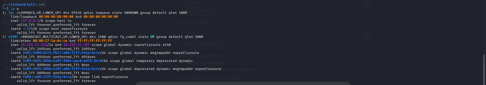
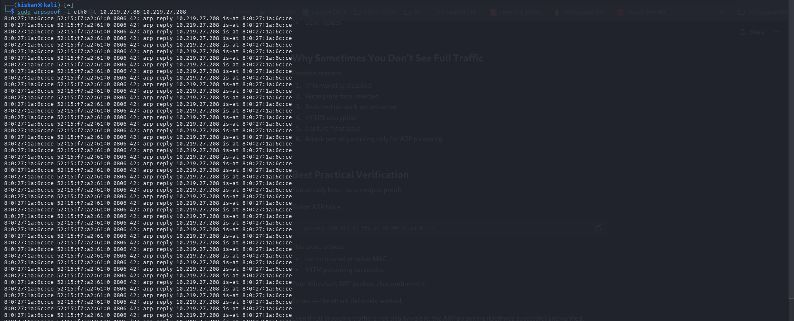
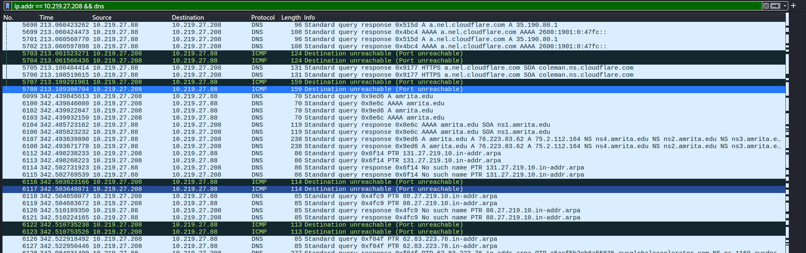
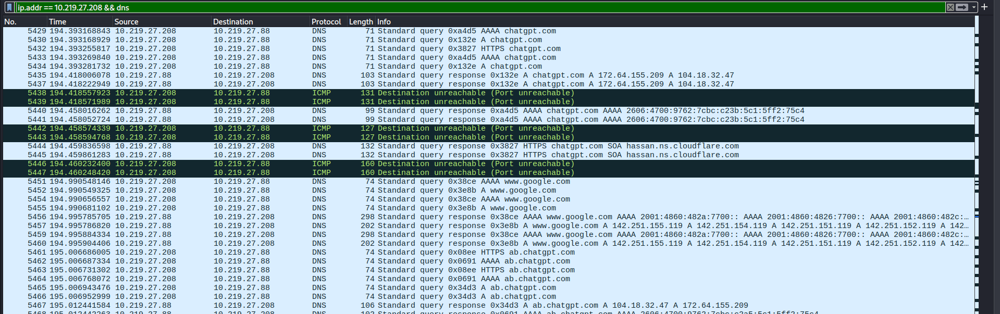

# ARP Spoofing — Man-in-the-Middle Attack Lab

**Date:** May 2026  
**Environment:** VirtualBox — controlled lab only, for educational purposes.

---

## Lab Setup

| Role     | OS         | IP Address    |
|----------|------------|---------------|
| Attacker | Kali Linux | 10.219.27.131 |
| Victim   | Kali Linux | 10.219.27.208 |
| Gateway  | Router     | 10.219.27.88  |

---

## Objective

Poison the ARP caches of the victim and gateway using `arpspoof`, position the attacker as a transparent MITM, and capture the victim's DNS traffic live using Wireshark.

---

## Tools Used

| Tool      | Purpose                        |
|-----------|--------------------------------|
| arpspoof  | ARP cache poisoning            |
| Wireshark | Live traffic interception      |
| sysctl    | Enable kernel IP forwarding    |
| ip / arp  | Network recon and verification |

---

## Execution

### 1. Confirm Attacker IP

```bash
ip a
```


Attacker is on `10.219.27.131`, interface `eth0`, MAC `08:00:27:1a:6c:ce`. This MAC will be injected into the victim's ARP cache as the gateway.

---

### 2. Confirm Victim IP

```bash
ip a   # run on victim
```



Victim is on `10.219.27.208`. All outbound traffic from this IP will be redirected to the attacker after poisoning.

---

### 3. Identify the Gateway

```bash
ip route
```


Both machines use `10.219.27.88` as the default gateway — the IP the attacker will impersonate to the victim.

---

### 4. Enable IP Forwarding

```bash
sudo sysctl -w net.ipv4.ip_forward=1
cat /proc/sys/net/ipv4/ip_forward
```


Output reads `1` — forwarding is on. Without this, the victim's internet drops immediately, raising suspicion. With it, traffic flows through the attacker transparently.

---

### 5. ARP Spoof — Poison the Victim

```bash
sudo arpspoof -i eth0 -t 10.219.27.208 10.219.27.88
```


Continuous ARP replies tell the victim: *"Gateway `10.219.27.88` is at `08:00:27:1a:6c:ce`"* (attacker's MAC). The victim now sends all outbound traffic to the attacker.

---

### 6. ARP Spoof — Poison the Gateway

```bash
sudo arpspoof -i eth0 -t 10.219.27.88 10.219.27.208
```



The gateway is told the victim's IP maps to the attacker's MAC. This makes the MITM fully bidirectional — return traffic from the internet also passes through the attacker.

---

### 7. Verify ARP Cache is Poisoned



Wireshark confirms poisoning is working — DNS and ICMP traffic from the victim (`10.219.27.208`) is appearing on the attacker's interface.

---

### 8. Victim Pings amrita.edu

```bash
ping amrita.edu   # run on victim
```


The victim runs a ping. The DNS resolution and ICMP traffic this generates all pass through the attacker silently.

---

### 9. Wireshark Captures the Ping Traffic

```
Filter: ip.addr == 10.219.27.208 && dns
```


The attacker's Wireshark shows the victim's DNS queries for `amrita.edu` in real time — A, AAAA, SOA, and PTR records all visible. ICMP rows confirm Layer 3 traffic is also being intercepted.

---

### 10. Victim Browses ChatGPT



The victim opens a browser and visits `chatgpt.com`. The attacker sees every DNS query: A and AAAA lookups, `ab.chatgpt.com` subdomains, and resolved IPs (`172.64.155.209`, `104.18.32.47`). DNS is unencrypted — even HTTPS sites reveal which domains the victim is visiting.

---

### 11. Cleanup

```bash
# Ctrl+C to stop both arpspoof processes
sudo sysctl -w net.ipv4.ip_forward=0
```


Forwarding disabled. Stopping `arpspoof` sends corrective ARP replies that restore the true MAC mappings on both the victim and gateway.

---

## Observations

- The attack is completely invisible to the victim — connection stays up, browsing works normally.
- DNS is the clearest MITM evidence — every domain lookup is visible in plaintext, even for HTTPS sites.
- Two-way poisoning is required — one direction gives only half the traffic.
- `arpspoof` must run continuously — legitimate ARP traffic will overwrite poisoned entries otherwise.

---

## Mitigation

| Defense                      | How It Helps                                            |
|------------------------------|---------------------------------------------------------|
| Dynamic ARP Inspection (DAI) | Switch validates ARP replies against DHCP binding table |
| Static ARP entries           | Permanent entries can't be overwritten by spoofed replies |
| DNS over HTTPS (DoH)         | Encrypts DNS queries — eliminates DNS interception      |
| VPN                          | Encrypts all traffic even if MITM position is achieved  |
| arpwatch / XArp              | Alerts on unexpected ARP table changes                  |

---

## Conclusion

ARP spoofing is a simple but highly effective attack on switched networks. With just `arpspoof` and Wireshark, a full MITM position was achieved in under a minute — capturing the victim's DNS queries for every site visited, including `chatgpt.com`, in real time. The victim noticed nothing. Proper defenses (DAI, DoH, VPN) significantly reduce the attack surface, but without them, any machine on the same subnet can silently intercept all network traffic.
