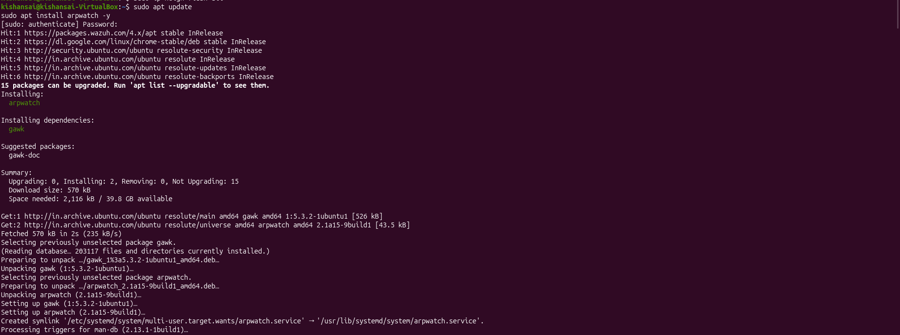
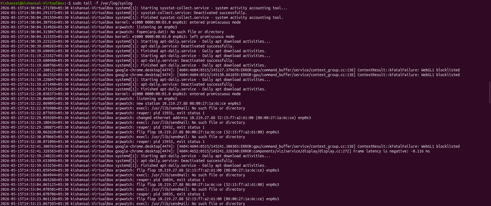
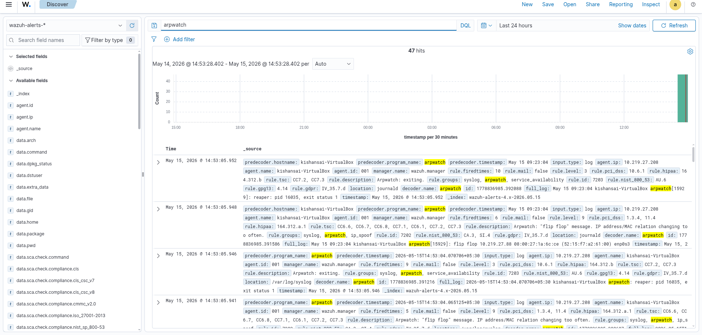
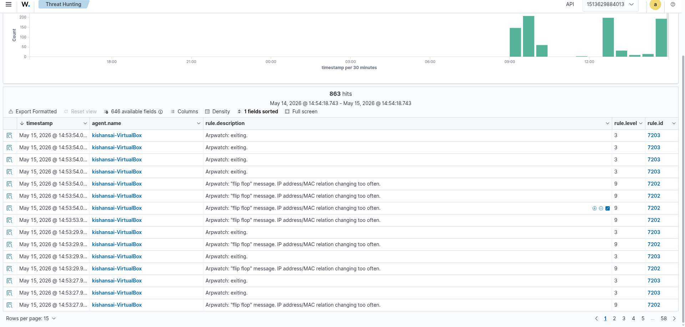
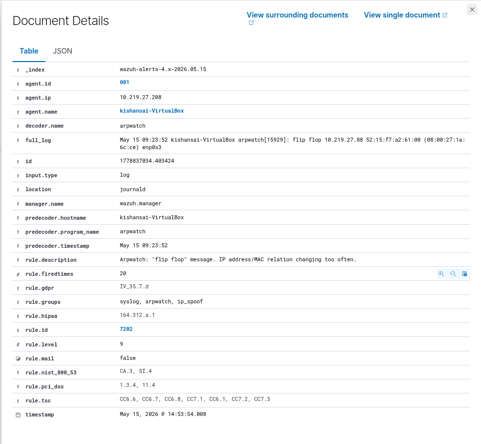

# ARP Spoofing — Man-in-the-Middle Attack Lab

**Date:** May 2026  
**Environment:** VirtualBox — controlled lab only, for educational purposes.

---

## Lab Setup

| Role     | OS         | IP Address    |
|----------|------------|---------------|
| Attacker | Kali Linux | 10.219.27.131 |
| Victim   | Kali Linux | 10.219.27.208 |
| Gateway  | Router     | 10.219.27.88  |

---

## Objective

Poison the ARP caches of the victim and gateway using `arpspoof`, position the attacker as a transparent MITM, and capture the victim's DNS traffic live using Wireshark.

---

## Tools Used

| Tool      | Purpose                        |
|-----------|--------------------------------|
| arpspoof  | ARP cache poisoning            |
| Wireshark | Live traffic interception      |
| sysctl    | Enable kernel IP forwarding    |
| ip / arp  | Network recon and verification |

---

## Execution

### 1. Confirm Attacker IP

```bash
ip a
```


Attacker is on `10.219.27.131`, interface `eth0`, MAC `08:00:27:1a:6c:ce`. This MAC will be injected into the victim's ARP cache as the gateway.

---

### 2. Confirm Victim IP

```bash
ip a   # run on victim
```


Victim is on `10.219.27.208`. All outbound traffic from this IP will be redirected to the attacker after poisoning.

---

### 3. Identify the Gateway

```bash
ip route
```


Both machines use `10.219.27.88` as the default gateway — the IP the attacker will impersonate to the victim.

---

### 4. Enable IP Forwarding

```bash
sudo sysctl -w net.ipv4.ip_forward=1
cat /proc/sys/net/ipv4/ip_forward
```


Output reads `1` — forwarding is on. Without this, the victim's internet drops immediately, raising suspicion. With it, traffic flows through the attacker transparently.

---

### 5. ARP Spoof — Poison the Victim

```bash
sudo arpspoof -i eth0 -t 10.219.27.208 10.219.27.88
```


Continuous ARP replies tell the victim: *"Gateway `10.219.27.88` is at `08:00:27:1a:6c:ce`"* (attacker's MAC). The victim now sends all outbound traffic to the attacker.

---

### 6. ARP Spoof — Poison the Gateway

```bash
sudo arpspoof -i eth0 -t 10.219.27.88 10.219.27.208
```


The gateway is told the victim's IP maps to the attacker's MAC. This makes the MITM fully bidirectional — return traffic from the internet also passes through the attacker.

---

### 7. Verify ARP Cache is Poisoned


Wireshark confirms poisoning is working — DNS and ICMP traffic from the victim (`10.219.27.208`) is appearing on the attacker's interface.

---

### 8. Victim Pings amrita.edu

```bash
ping amrita.edu   # run on victim
```


The victim runs a ping. The DNS resolution and ICMP traffic this generates all pass through the attacker silently.

---

### 9. Wireshark Captures the Ping Traffic

```
Filter: ip.addr == 10.219.27.208 && dns
```


The attacker's Wireshark shows the victim's DNS queries for `amrita.edu` in real time — A, AAAA, SOA, and PTR records all visible. ICMP rows confirm Layer 3 traffic is also being intercepted.

---

### 10. Victim Browses ChatGPT


The victim opens a browser and visits `chatgpt.com`. The attacker sees every DNS query: A and AAAA lookups, `ab.chatgpt.com` subdomains, and resolved IPs (`172.64.155.209`, `104.18.32.47`). DNS is unencrypted — even HTTPS sites reveal which domains the victim is visiting.

---

### 11. Cleanup

```bash
# Ctrl+C to stop both arpspoof processes
sudo sysctl -w net.ipv4.ip_forward=0
```


Forwarding disabled. Stopping `arpspoof` sends corrective ARP replies that restore the true MAC mappings on both the victim and gateway.

---

## Wazuh SIEM Integration and ARP Spoofing Detection

After verifying the MITM attack through Wireshark, I wanted to take it a step further and get proper SIEM-level visibility. Wireshark works great for live analysis but it's manual — you have to be watching. The goal here was to get Wazuh to automatically alert whenever ARP spoofing activity is detected on the victim machine, using `arpwatch` as the detection agent.

---

### 12. Install arpwatch on Victim Machine

```bash
sudo apt update
sudo apt install arpwatch -y
```



`arpwatch` installs cleanly along with `gawk` as a dependency. It creates a systemd service automatically. `arpwatch` monitors the ARP table on the interface and writes events to syslog whenever it notices a MAC address change for a known IP — which is exactly what ARP spoofing causes.

---

### 13. Create arpwatch Database File and Start Monitoring

Before starting `arpwatch`, the database file it uses to track ARP mappings needs to exist.

```bash
sudo touch /var/lib/arpwatch/arp.dat
sudo chmod 644 /var/lib/arpwatch/arp.dat
sudo arpwatch -i enp0s3 -f /var/lib/arpwatch/arp.dat
```

The victim's interface here is `enp0s3` (confirmed from `ip a`). The `-f` flag points `arpwatch` to its tracking file. Once started, it begins learning the current MAC-to-IP mappings on the network as a baseline. Any deviation from that baseline triggers a log entry.

---

### 14. Relaunch the ARP Spoofing Attack

With `arpwatch` now active on the victim, the attack is relaunched from the attacker machine so that the MAC address changes hit while monitoring is live.

```bash
# Terminal 1 — Attacker
sudo arpspoof -i eth0 -t 10.219.27.208 10.219.27.88

# Terminal 2 — Attacker
sudo arpspoof -i eth0 -t 10.219.27.88 10.219.27.208
```

The victim also generates traffic to force ARP resolution updates:

```bash
ping google.com   # run on victim
```

---

### 15. arpwatch Detects the Attack in syslog

```bash
sudo tail -f /var/log/syslog
```



This is where the detection happens. The syslog output shows `arpwatch` catching the attack in real time:

- `arpwatch: new station 10.219.27.88 08:00:27:1a:6c:ce` — baseline recorded when arpwatch first started.
- `arpwatch: changed ethernet address 10.219.27.88 52:15:f7:a2:61:00 (08:00:27:1a:6c:ce) enp0s3` — the gateway's IP is now mapping to a **different** MAC than what was recorded. This is the direct signature of ARP cache poisoning.
- `arpwatch: flip flop 10.219.27.88 08:00:27:1a:6c:ce (52:15:f7:a2:61:00) enp0s3` — the MAC for the gateway IP keeps switching back and forth between two addresses. This happens because both `arpspoof` processes are running simultaneously, fighting to claim the same IP with different MACs. Flip flop is one of the strongest ARP spoofing indicators.

The attack was running for less than 30 seconds before these entries started appearing.

---

### 16. Add Custom Wazuh Rules for ARP Spoofing Detection

By default, Wazuh has a built-in rule (`7202`) for arpwatch flip flop events, but to make the alerts more explicit and easier to search in the dashboard, custom rules were added inside the Wazuh manager container.

```bash
docker exec -it single-node-wazuh.manager-1 bash
```

Inside the container, append to `/var/ossec/etc/rules/local_rules.xml`:

```xml
<group name="arpwatch,network,">
  <rule id="100500" level="12">
    <match>changed ethernet address</match>
    <description>Possible ARP Spoofing Detected</description>
  </rule>

  <rule id="100501" level="10">
    <match>flip flop</match>
    <description>ARP MAC Address Flapping Detected</description>
  </rule>
</group>
```

Then restart the manager to load the new rules:

```bash
/var/ossec/bin/wazuh-control restart
```

`rule id 100500` fires on `changed ethernet address` — the first hard sign that ARP poisoning is happening. `rule id 100501` fires on `flip flop` — the repeated MAC switching that confirms a sustained MITM. Both are set to high severity levels (12 and 10) so they appear prominently in the dashboard.

---

### 17. Wazuh SIEM — Alerts Generated

#### Discover View — arpwatch Events



Searching `arpwatch` in the Wazuh Discover view returns 47 hits. The events clearly show two rule descriptions repeating: *"Arpwatch: flip flop message. IP address/MAC relation changing too often"* (`rule.id: 7202`, level 9) and *"Arpwatch: exiting"* (`rule.id: 7203`, level 3). The `rule.groups` field includes `ip_spoof` — Wazuh's built-in decoder already categorised this as IP spoofing activity before the custom rules even fired. The histogram spike in the top right aligns exactly with when the attack was running.

---

#### Threat Hunting View — Alert Volume



The Threat Hunting view shows 863 total hits over the session. The dominant alert is `rule.id: 7202` — *"Arpwatch: flip flop message. IP address/MAC relation changing too often"* — repeating continuously at level 9. The histogram shows clear bursts of activity corresponding to each time the attack was relaunched. Every flip flop event is a separate alert, making the attack pattern extremely visible in a SOC dashboard.

---

#### Document View — Full Alert Detail



Opening one alert document shows the full event detail:

- `agent.ip`: `10.219.27.208` — the victim machine generated this alert
- `decoder.name`: `arpwatch` — correctly decoded by Wazuh
- `full_log`: `flip flop 10.219.27.88 52:15:f7:a2:61:00 (08:00:27:1a:6c:ce) enp0s3` — the exact MAC addresses flipping, and the interface they were seen on
- `rule.id`: `7202`, `rule.level`: `9`
- `rule.groups`: `syslog, arpwatch, ip_spoof` — categorised as IP spoofing
- `rule.firedtimes`: `20` — this single rule fired 20 times during the session
- `rule.gdpr`: `IV_35.7.d`, `rule.hipaa`: `164.312.a.1`, `rule.pci_dss`: `1.3.4, 11.4` — compliance frameworks automatically tagged

The `full_log` field alone tells the whole story: the gateway IP (`10.219.27.88`) is rapidly alternating between two MAC addresses — the attacker's and the real one — which is exactly what a live ARP spoofing attack looks like from the victim's perspective.

---

## Observations

- The MITM was completely invisible to the victim during Wireshark-only monitoring — connection stayed up, browsing worked normally.
- `arpwatch` detected the attack within seconds of the first spoofed ARP reply arriving — `changed ethernet address` and `flip flop` events appeared almost immediately in syslog.
- Wazuh ingested the `arpwatch` syslog entries and fired `rule.id: 7202` (`ip_spoof` group) automatically, without needing the custom rules. The custom rules add an additional layer with higher severity levels for explicit dashboard visibility.
- The `rule.firedtimes: 20` on a single alert and 863 total hits in Threat Hunting show how noisy a sustained ARP spoofing attack is — it doesn't hide quietly.
- SIEM integration changes detection from reactive (someone manually running Wireshark) to proactive — alerts fire automatically and are retained with full compliance tagging.

---

## Mitigation

| Defense                      | How It Helps                                              |
|------------------------------|-----------------------------------------------------------|
| Dynamic ARP Inspection (DAI) | Switch validates ARP replies against DHCP binding table   |
| Static ARP entries           | Permanent entries can't be overwritten by spoofed replies |
| DNS over HTTPS (DoH)         | Encrypts DNS queries — eliminates DNS interception        |
| VPN                          | Encrypts all traffic even if MITM position is achieved    |
| arpwatch + Wazuh SIEM        | Detects and alerts on MAC address instability in real time |

---

## Conclusion

This task demonstrated a complete ARP spoofing MITM attack and its detection using two approaches. The first phase used `arpspoof` and Wireshark to prove the attack works — victim traffic was intercepted, DNS queries for `amrita.edu` and `chatgpt.com` were captured in plaintext, and the victim had no idea. The second phase added proper detection: `arpwatch` on the victim caught the MAC address instability immediately, logging `changed ethernet address` and `flip flop` events to syslog. Wazuh ingested those logs, fired `rule.id: 7202` under the `ip_spoof` group, and generated 863 alerts with full compliance tagging across GDPR, HIPAA, and PCI-DSS.

The key takeaway is that ARP spoofing is a Layer 2 attack that network-level tools alone won't catch — you need host-based monitoring like `arpwatch` feeding into a SIEM to get reliable, automated detection. Integrating the two gives visibility into attacks that would otherwise be completely silent.
