# FTP Brute Force Attack Detection using Wazuh SIEM

## **Date:** 6th & 7th May, 2026

This is a hands-on lab where I set up a real FTP service, ran brute force attacks against it using Hydra and Medusa, and monitored everything through Wazuh SIEM. I also wrote custom Wazuh rules to detect file uploads and downloads. Done in a controlled VM environment for learning purposes.

---

## Task Environment

Three VMs in VirtualBox — one as attacker, one as victim running vsftpd, and one running the Wazuh server in Docker.

| Role         | OS            | IP Address     |
|--------------|---------------|----------------|
| Attacker     | Kali Linux    | 10.181.125.131 |
| Victim       | Ubuntu        | 10.181.125.208 |
| Wazuh Server | Kali (Docker) | 10.181.125.37  |

---

## Objective

- Set up vsftpd on Ubuntu and configure it properly
- Run FTP brute force attacks using Hydra and Medusa
- Detect everything through Wazuh
- Write custom rules to detect file transfers (uploads and downloads)
- Map it all to MITRE ATT&CK

---

## Tools Used

**Wazuh SIEM** — Used for monitoring and detection. I deployed an agent on the Ubuntu victim and pointed it at the vsftpd log file. All FTP events showed up in the Wazuh dashboard with rule alerts and decoded fields.

**Hydra** — Fast FTP brute force tool. I used it twice — once with a single username and once with a full user list.

**Medusa** — Another brute force tool, steadier than Hydra. I kept threads low at `-t 2` and used `-v 6` for full verbose output.

**Nmap** — Used before the attacks just to confirm port 21 was open on the victim.

**vsftpd** — The FTP service I set up on Ubuntu. Logs go to `/var/log/vsftpd.log`, which is what Wazuh monitors.

---

## Hydra vs Medusa

| Feature | Hydra | Medusa |
|---|---|---|
| Speed | Faster | Slower but steadier |
| VM Stability | Can timeout at high threads | Stable with `-t 2` |
| Protocol Support | 50+ | ~20+ |
| Output | Shows result only | Shows every attempt with `-v 6` |

---

## Lab Setup

### Installing vsftpd

```bash
sudo apt update
sudo apt install vsftpd -y
sudo systemctl start vsftpd
sudo systemctl enable vsftpd
sudo systemctl status vsftpd
sudo ss -tulnp | grep :21
```

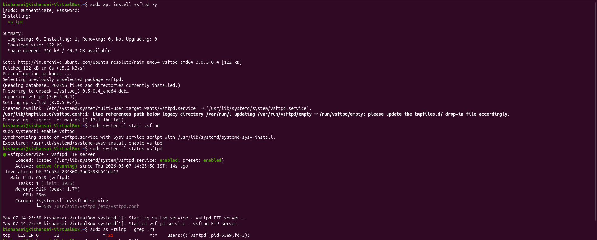

Installed vsftpd, started and enabled it, then checked that it's running. The `ss` command at the end confirms port 21 is listening — `tcp LISTEN 0 32 *:21`. Service is up and ready.

### vsftpd Config

```bash
sudo nano /etc/vsftpd.conf
```

```ini
listen=YES
listen_ipv6=NO
anonymous_enable=NO
local_enable=YES
write_enable=YES
```

Turned off anonymous access, enabled local users. This way the brute force attempts actually go through real authentication.

### Creating the Victim User

```bash
sudo adduser victim
```

Created a user `victim` with password `test`. Weak password on purpose — needed it to be crackable with a small wordlist so I could see the full detection flow in Wazuh.

---

## Network Verification

### Victim IP

```bash
ip a
```

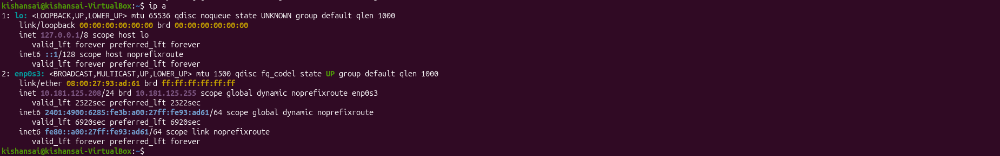

Ubuntu victim is on `10.181.125.208` — the target IP for all attacks.

### Attacker IP

```bash
ip a
```

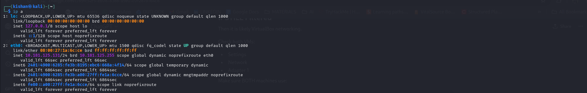

Kali attacker is on `10.181.125.131` — this is the source IP that shows up in every Wazuh log.

### Nmap Scan

```bash
nmap -sV 10.181.125.208
```

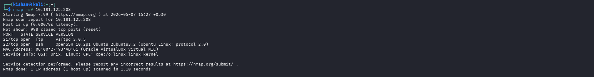

Port 21 is open, vsftpd 3.0.5 running. Port 22 is also there since it's Ubuntu. No firewall issues. FTP is reachable from the attacker, good to go.

---

## Configuring Wazuh Agent to Monitor vsftpd Logs

Wazuh doesn't monitor `/var/log/vsftpd.log` by default, so I had to add it manually.

```bash
sudo nano /var/ossec/etc/ossec.conf
```

```xml
<localfile>
  <log_format>syslog</log_format>
  <location>/var/log/vsftpd.log</location>
</localfile>
```


The screenshot shows the `ossec.conf` with the `localfile` block added. Without this, nothing would show up in Wazuh no matter how many attacks I ran.

```bash
sudo systemctl restart wazuh-agent
sudo systemctl status wazuh-agent
```

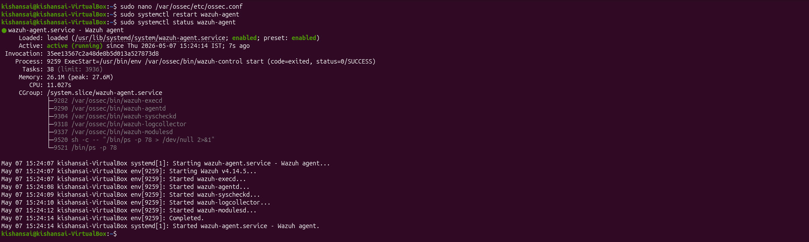

Restarted the agent and checked status. All components are running — `wazuh-agentd`, `wazuh-logcollector`, `wazuh-execd`, etc. The journal entries confirm it started clean. Agent is now forwarding vsftpd logs to the Wazuh manager.

---

## Attack Method 1 — Manual FTP Login

I did a few manual logins first — some correct, some wrong — just to make sure Wazuh was actually capturing FTP events before I started the automated attacks.

```bash
ftp 10.181.125.208
```

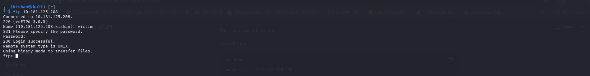

Connected from Kali, got the `220 (vsFTPd 3.0.5)` banner, logged in as `victim`, got `230 Login successful`. Basic check passed — FTP works end to end.

### Wazuh — Login Event Document

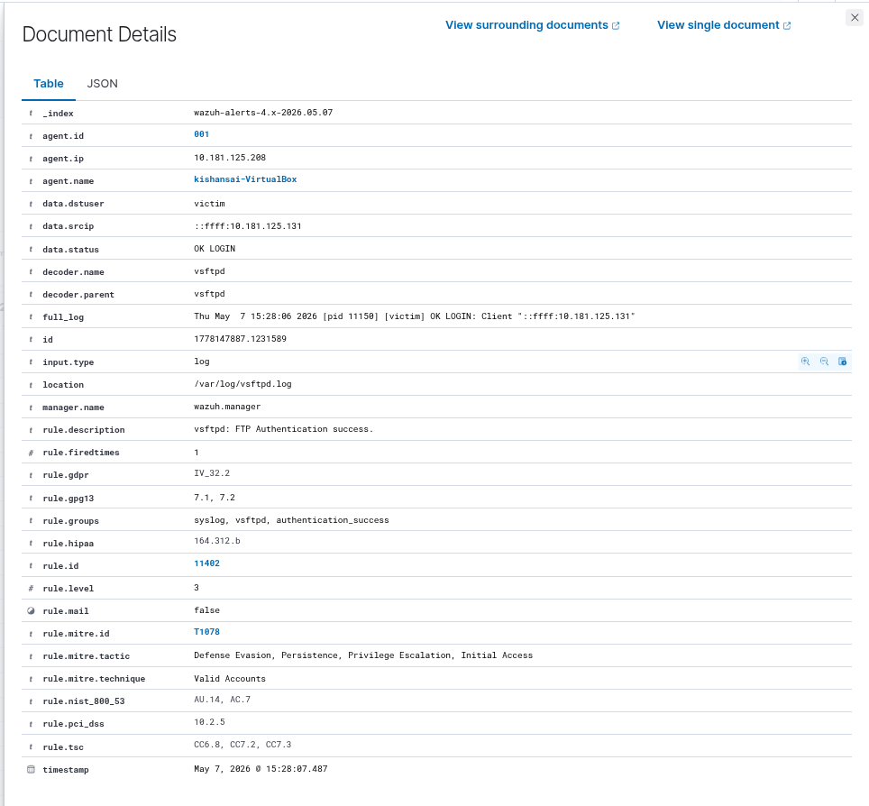

Pulled up the event in Wazuh. It shows `rule.id: 11402`, `data.status: OK LOGIN`, `data.dstuser: victim`, `data.srcip: ::ffff:10.181.125.131`, `decoder.name: vsftpd`. MITRE T1078 auto-tagged. Wazuh decoded it correctly and the rule fired as expected.

### Wazuh — Filtered View

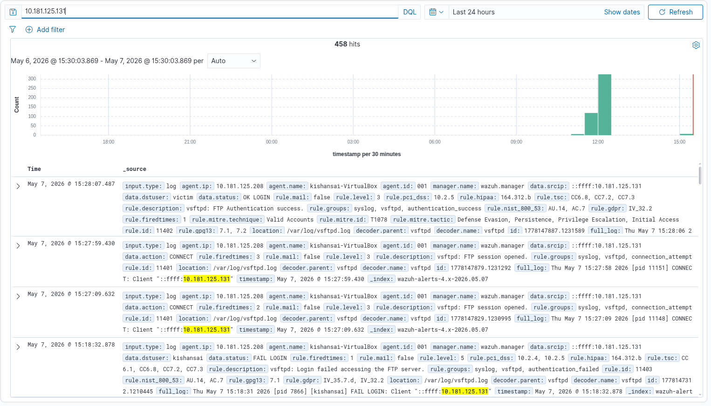

Filtered by attacker IP and saw events from the manual testing — `11402` for the successful login, `11401` for FTP session opened, and `11403` for the intentional failed attempts. Everything is being captured. Moved on to the actual attacks.

---

## Attack Method 2 — Hydra Single Username

```bash
hydra -l victim -P pass.txt ftp://10.181.125.208
```

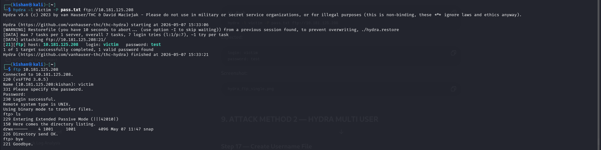

Hydra ran through 7 passwords for `victim`. Found it almost immediately — `login: victim password: test`. I then manually connected to verify: `230 Login successful` and `ls` showed the victim's home directory. Done in about 15 seconds.

### Wazuh — Rule 40112

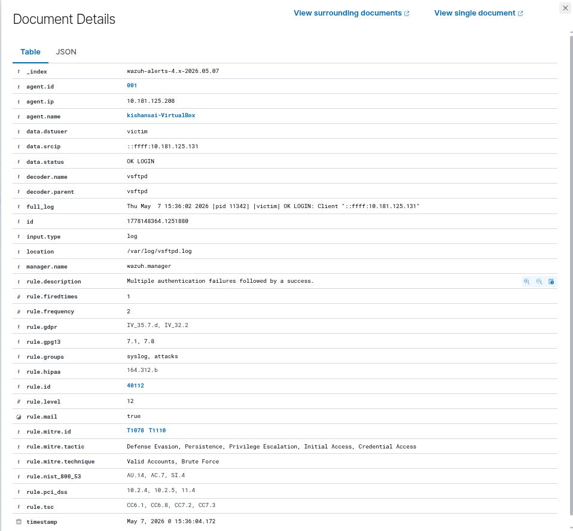

The key alert: `rule.id: 40112`, `rule.level: 12` — "Multiple authentication failures followed by a success." This is the composite rule that fires when Wazuh sees the failed attempts followed by a successful login from the same IP. `data.status: OK LOGIN`, `rule.mail: true`. MITRE T1078 and T1110 both tagged.

### Wazuh — Events After Attack

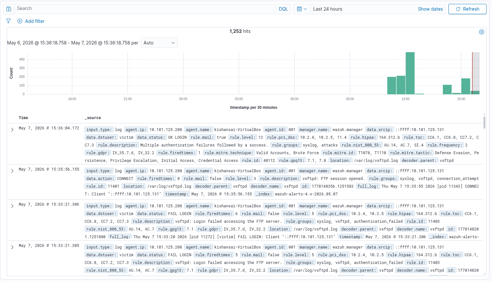

After the attack, filtering by attacker IP shows 1,252 hits total. Top of the list is the severity-12 alert, then `11401` and `11403` events below it. Clear spike in the histogram right when Hydra ran.

---

## Attack Method 3 — Hydra Multi-User

This time I used a full list of usernames and passwords to simulate not knowing which accounts exist.

```bash
hydra -L users.txt -P pass.txt -t 2 ftp://10.181.125.208
```

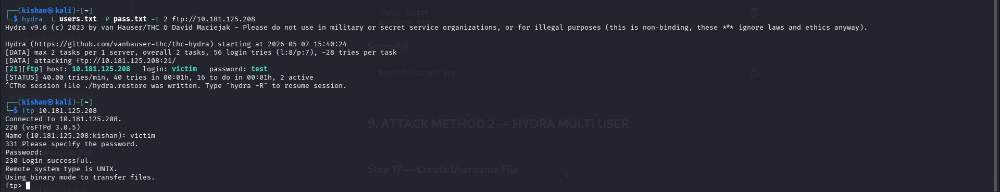

56 total attempts — 8 usernames × 7 passwords. Found `victim:test` again. Used `-t 2` to avoid connection timeouts in the VM. Verified afterward with a manual FTP session — `230 Login successful`.

### Wazuh — Threat Hunting View

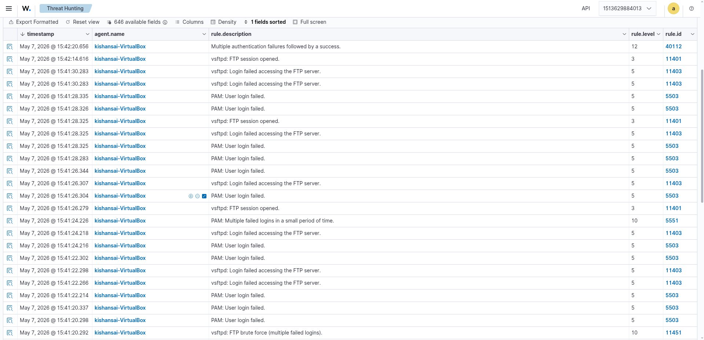

The Threat Hunting view shows the full event chain. At the top is `rule.id: 40112` (level 12), then a stream of `11403` (login failed) and `5503` (PAM: User login failed) events from every failed attempt. `rule.id: 11451` (FTP brute force) and `5551` (PAM: multiple failed logins) also fired — multiple independent rules all picking up the same attack.

### Wazuh — Rule 40112 Document


Same `rule.id: 40112` at level 12. `rule.firedtimes: 3` — third time this alert fired across the session. `full_log` shows `[victim] OK LOGIN: Client "::ffff:10.181.125.131"` at `15:42:19`. GDPR, HIPAA, PCI-DSS, NIST compliance all auto-tagged.

---

## Attack Method 4 — Medusa

```bash
medusa -h 10.181.125.208 -U users.txt -P pass.txt -M ftp -t 2 -v 6
```

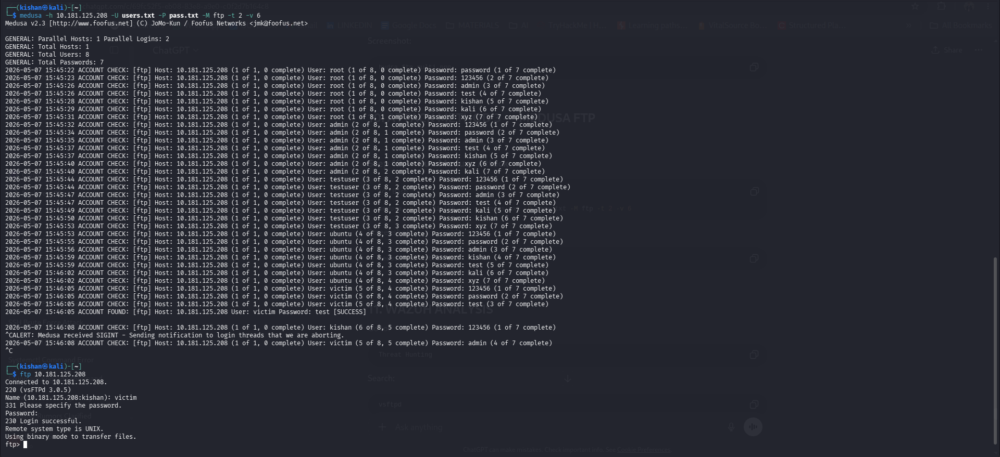

Medusa worked through all 56 combinations one by one, printing each attempt with a timestamp. When it hit `victim:test` it printed `ACCOUNT FOUND: [ftp] Host: 10.181.125.208 User: victim Password: test [SUCCESS]`. Verified manually after — `230 Login successful` again.

### Wazuh — Medusa Document

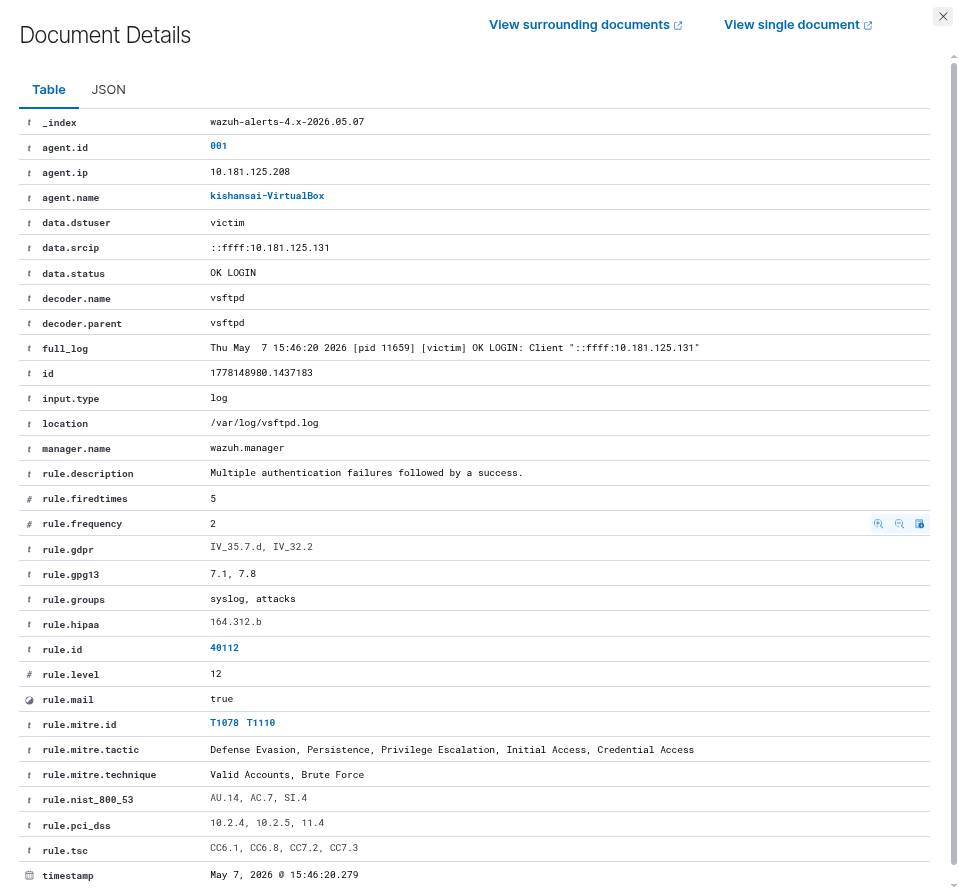

Same story — `rule.id: 40112`, level 12, `rule.firedtimes: 5`, `decoder.name: vsftpd`. Same rules fired as with Hydra. Switching tools makes zero difference to Wazuh — it detects the behavior in the logs, not what tool caused it.

### Wazuh — vsftpd Filter

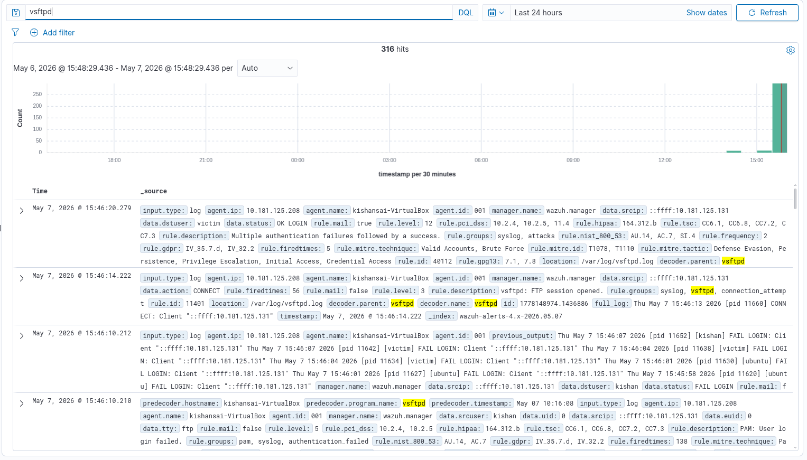

Filtering by `vsftpd` after Medusa shows 316 hits, all in a sharp spike on the histogram. Top is the level-12 alert, followed by `11401` and `11403` events. One event shows Wazuh batching multiple consecutive FAIL LOGIN lines into a single `previous_output` entry.

---

## Custom Wazuh Rules — FTP File Transfer Detection

After the brute force attacks, I wanted to go one step further and see if I could get Wazuh to detect actual file transfers — uploads and downloads — not just logins. By default it doesn't have rules for `OK UPLOAD` or `OK DOWNLOAD` in vsftpd logs, so I wrote them myself.

Inside the Wazuh manager Docker container, I appended rules to `local_rules.xml`:

```bash
cat >> /var/ossec/etc/rules/local_rules.xml << 'EOF'

<group name="ftp_custom">

  <rule id="100500" level="7">
    <match>OK UPLOAD</match>
    <description>FTP File Upload Detected</description>
    <group>ftp,file_upload,file_transfer,</group>
  </rule>

  <rule id="100501" level="7">
    <match>OK DOWNLOAD</match>
    <description>FTP File Download Detected</description>
    <group>ftp,file_download,file_transfer,</group>
  </rule>

  <rule id="100502" level="6">
    <match>STOR</match>
    <description>FTP Upload Command Detected</description>
    <group>ftp,file_upload,file_transfer,</group>
  </rule>

  <rule id="100503" level="6">
    <match>RETR</match>
    <description>FTP Download Command Detected</description>
    <group>ftp,file_download,file_transfer,</group>
  </rule>

  <rule id="100600" level="7">
    <if_sid>11404</if_sid>
    <description>FTP File Upload Detected With Source IP</description>
    <group>ftp,file_upload,file_transfer,</group>
  </rule>

</group>

EOF
```

What each rule does:

- `100500` — matches `OK UPLOAD` in the vsftpd log
- `100501` — matches `OK DOWNLOAD`
- `100502` — matches the `STOR` FTP command (upload command)
- `100503` — matches the `RETR` FTP command (download command)
- `100600` — builds on the built-in rule `11404` and adds source IP visibility for uploads

After adding them, I restarted the manager:

```bash
/var/ossec/bin/wazuh-control restart
```

### FTP File Transfer from Attacker

```bash
ftp 10.181.125.208
ftp> put ftp_trans.txt
ftp> put ftp_Trans2.txt
ftp> get ftp_Trans2.txt
```

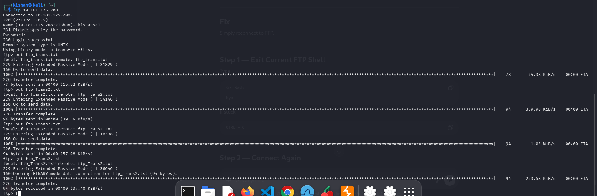

Logged into the victim's FTP as `kishansai` from Kali and ran a few uploads and one download. Both `put` commands completed with `226 Transfer complete`. The `get ftp_Trans2.txt` pulled the file back — `94 bytes received`. Every one of these operations writes an `OK UPLOAD` or `OK DOWNLOAD` line into the vsftpd log, which my custom rules now match.

### Wazuh — File Transfer Discover View

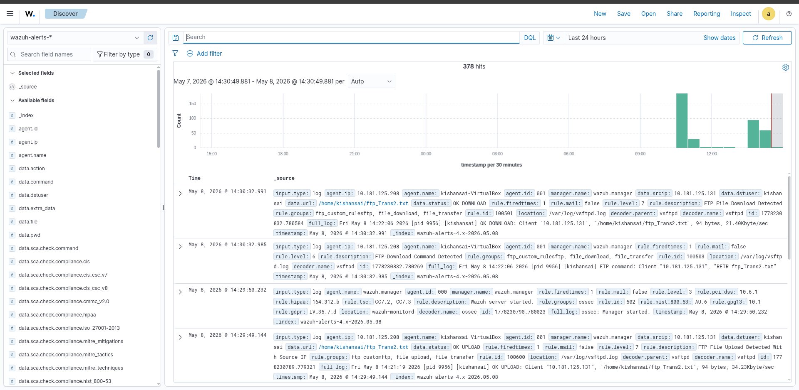

The Discover view shows 378 hits with the file transfer events at the top. `rule.id: 100501` (FTP File Download Detected) at `14:30:32` with `data.url: /home/kishansai/ftp_Trans2.txt` and `data.status: OK DOWNLOAD`. Below it, `rule.id: 100503` (FTP Download Command Detected) from the `RETR` command. Further down, `rule.id: 100600` (FTP File Upload Detected With Source IP) with `data.status: OK UPLOAD`. All four custom rules fired.

### Wazuh — Download Alert Document

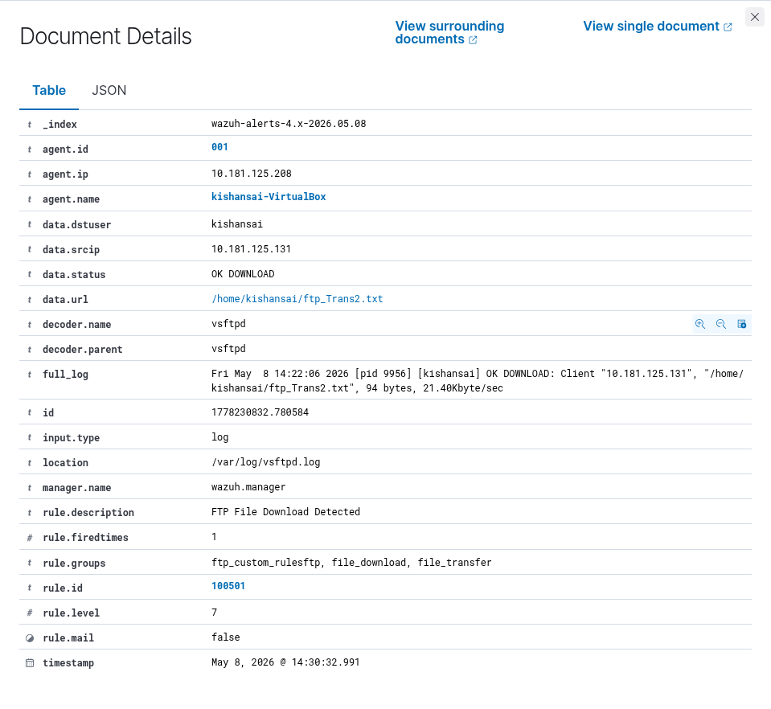

Opened the document for the download event. `rule.id: 100501`, `rule.level: 7`, `data.dstuser: kishansai`, `data.srcip: 10.181.125.131`, `data.status: OK DOWNLOAD`, `data.url: /home/kishansai/ftp_Trans2.txt`. The `full_log` shows the raw vsftpd line: `[kishansai] OK DOWNLOAD: Client "10.181.125.131", "/home/kishansai/ftp_Trans2.txt", 94 bytes, 21.40Kbyte/sec`. Filename, source IP, size, transfer speed — all in one event.

### Wazuh — Upload Alert Document

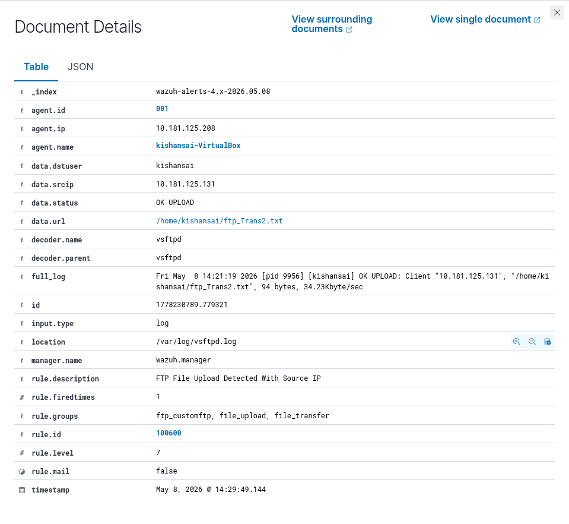

Same structure for the upload. `rule.id: 100600`, `data.status: OK UPLOAD`, `data.url: /home/kishansai/ftp_Trans2.txt`, `full_log` shows `[kishansai] OK UPLOAD: Client "10.181.125.131", "/home/kishansai/ftp_Trans2.txt", 94 bytes, 34.23Kbyte/sec`. Upload direction, same detail level.

### Wazuh — Threat Hunting File Transfer Chain

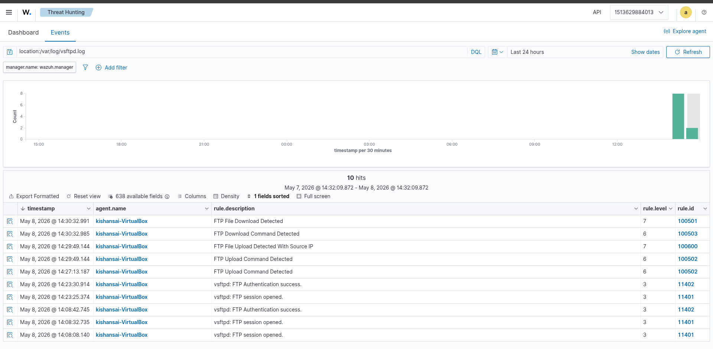

Filtered by `location:/var/log/vsftpd.log` in Threat Hunting. 10 hits total, covering the whole session from login to file transfers. Reading top to bottom: `100501` (download detected), `100503` (download command), `100600` (upload detected), `100502` (upload command), then `11402` (auth success) and `11401` (session opened) from the login itself. The full chain — login, auth, upload, download — is all there.

---

## Log Analysis

Wazuh Agent (ID: 001, `kishansai-VirtualBox`) on the victim reads `/var/log/vsftpd.log` and forwards everything to the Wazuh manager. All events decoded using the `vsftpd` decoder, stored in `wazuh-alerts-4.x-2026.05.07` and `wazuh-alerts-4.x-2026.05.08`.

### Rule IDs Observed

| Rule ID | Description | Level |
|---|---|---|
| 11401 | vsftpd: FTP session opened | 3 |
| 11402 | vsftpd: FTP Authentication success | 3 |
| 11403 | vsftpd: Login failed accessing the FTP server | 5 |
| 11451 | vsftpd: FTP brute force (multiple failed logins) | 10 |
| 5503 | PAM: User login failed | 5 |
| 5551 | PAM: Multiple failed logins in a small period of time | 10 |
| 40112 | Multiple authentication failures followed by a success | 12 |
| 100500 | FTP File Upload Detected (custom) | 7 |
| 100501 | FTP File Download Detected (custom) | 7 |
| 100502 | FTP Upload Command Detected (custom) | 6 |
| 100503 | FTP Download Command Detected (custom) | 6 |
| 100600 | FTP File Upload Detected With Source IP (custom) | 7 |

### Event Volume

| Attack Method | Tool | Events |
|---|---|---|
| Method 1 — Manual | Manual | Baseline |
| Method 2 — Hydra Single User | Hydra | ~25 hits |
| Method 3 — Hydra Multi-User | Hydra | ~56+ hits |
| Method 4 — Medusa | Medusa | 316 hits |

### MITRE ATT&CK Mapping

| MITRE ID | Technique | Tactic |
|---|---|---|
| T1110 | Brute Force | Credential Access |
| T1110.001 | Password Guessing | Credential Access |
| T1078 | Valid Accounts | Defense Evasion, Persistence, Initial Access |
| T1021 | Remote Services | Lateral Movement |

---

## What I Observed

**Weak passwords don't stand a chance.** `victim:test` was in a 7-entry list. Both Hydra and Medusa cracked it in seconds. In a real attack scenario with a proper wordlist, this would be instant.

**The volume of failed logins is very obvious.** Even a small Hydra run generates dozens of events from one IP in a few seconds. That pattern sticks out immediately in Wazuh.

**Rule 40112 is the one to watch.** It fires when failures are followed by a success from the same source — the direct signature of a completed brute force. Fired every time without fail.

**Wazuh caught it regardless of which tool I used.** Hydra and Medusa both triggered the exact same rule IDs. The detection is based on the vsftpd log content, not the attack tool.

**PAM adds a second detection layer.** `5503` and `5551` fired from PAM alongside the vsftpd rules. Two independent detection paths from a single attack.

**Custom rules filled a real gap.** Default Wazuh has nothing for `OK UPLOAD` or `OK DOWNLOAD`. After adding five rules, every file transfer shows up with the filename, source IP, user, size, and speed. Much more useful for investigating what actually happened after a successful login.

---

## Conclusion

Set up vsftpd, configured Wazuh to monitor it, ran four brute force methods, then wrote custom rules to catch file transfers too. Every attack was detected — rule 40112 fired on each successful brute force, and the custom rules caught the uploads and downloads with full detail. The whole attack chain from first failed login to file exfiltration is visible in Wazuh.

---

## Commands Reference

### Victim — FTP Setup

```bash
sudo apt update && sudo apt install vsftpd -y
sudo systemctl start vsftpd
sudo systemctl enable vsftpd
sudo systemctl status vsftpd
sudo ss -tulnp | grep :21
sudo nano /etc/vsftpd.conf
sudo adduser victim
sudo tail -f /var/log/vsftpd.log
```

### Victim — Wazuh Agent Config

```bash
sudo nano /var/ossec/etc/ossec.conf
sudo systemctl restart wazuh-agent
sudo systemctl status wazuh-agent
```

```xml
<localfile>
  <log_format>syslog</log_format>
  <location>/var/log/vsftpd.log</location>
</localfile>
```

### Attacker — Recon

```bash
ip a
nmap -sV 10.181.125.208
ftp 10.181.125.208
```

### Hydra Single User

```bash
hydra -l victim -P pass.txt ftp://10.181.125.208
```

### Hydra Multi-User

```bash
hydra -L users.txt -P pass.txt -t 2 ftp://10.181.125.208
```

### Medusa

```bash
medusa -h 10.181.125.208 -U users.txt -P pass.txt -M ftp -t 2 -v 6
```

### Wazuh Manager — Custom Rules

```bash
cat >> /var/ossec/etc/rules/local_rules.xml << 'EOF'

<group name="ftp_custom">

  <rule id="100500" level="7">
    <match>OK UPLOAD</match>
    <description>FTP File Upload Detected</description>
    <group>ftp,file_upload,file_transfer,</group>
  </rule>

  <rule id="100501" level="7">
    <match>OK DOWNLOAD</match>
    <description>FTP File Download Detected</description>
    <group>ftp,file_download,file_transfer,</group>
  </rule>

  <rule id="100502" level="6">
    <match>STOR</match>
    <description>FTP Upload Command Detected</description>
    <group>ftp,file_upload,file_transfer,</group>
  </rule>

  <rule id="100503" level="6">
    <match>RETR</match>
    <description>FTP Download Command Detected</description>
    <group>ftp,file_download,file_transfer,</group>
  </rule>

  <rule id="100600" level="7">
    <if_sid>11404</if_sid>
    <description>FTP File Upload Detected With Source IP</description>
    <group>ftp,file_upload,file_transfer,</group>
  </rule>

</group>

EOF

/var/ossec/bin/wazuh-control restart
```

### FTP File Transfer

```bash
ftp 10.181.125.208
ftp> put ftp_trans.txt
ftp> put ftp_Trans2.txt
ftp> get ftp_Trans2.txt
```
