# File Integrity Tampering Attack Detection using Wazuh FIM

## **Date:** May 21, 2026

This is a hands-on lab where I set up an Apache web server on Ubuntu, configured Wazuh FIM to monitor the web directory in realtime, then attacked from a separate Kali machine — gaining SSH access, tampering with the website files, and performing a full defacement. Wazuh caught every single file modification with before/after checksums. Done in a controlled VM environment for learning purposes.

---

## Lab Environment

| Role | OS | IP Address |
|------|----|----|
| Attacker | Kali Linux | 10.219.27.131 |
| Victim | Ubuntu 26.04 | 10.219.27.208 |
| Wazuh Server | Kali (Docker) | 10.219.27.37 |

---

## Objective

- Set up Apache2 on Ubuntu and verify it's serving a webpage
- Configure Wazuh FIM with realtime monitoring on `/var/www/html`
- Gain SSH access to the victim and tamper with website files
- Perform website defacement using two different methods
- Detect all file changes through Wazuh with full checksum analysis
- Map everything to MITRE ATT&CK

---

## Tools Used

**Wazuh SIEM** — Core detection platform. Wazuh agent runs on the Ubuntu victim and forwards syscheck (FIM) and journal (sudo) events to the Wazuh manager. Once I configured realtime FIM on `/var/www/html`, every write to that directory triggered an immediate alert.

**Apache2** — The web server running on the victim. Its web root at `/var/www/html/index.html` is the file I targeted for defacement.

**Nmap** — Used from the attacker machine to identify which services were running on the victim before attempting access.

**SSH** — The attacker's method of gaining a shell on the victim. Simulates a scenario where credentials were stolen or guessed.

**Tee / Nano** — Linux tools used inside the victim shell to overwrite `index.html`. These represent the attacker's tampering actions post-access.

---

## Attack Architecture Flow

```
Reconnaissance (Nmap)
        ↓
SSH Access to Victim
        ↓
Privilege Escalation (sudo)
        ↓
Website File Enumeration (ls /var/www/html)
        ↓
Website Defacement — Method 1 (tee)
        ↓
Website Defacement — Method 2 (nano)
        ↓
Wazuh FIM Detection (rule.id: 550)
        ↓
SOC Investigation (Discover + Threat Hunting)
        ↓
Mitigation
```

---

## Wazuh FIM Configuration

By default, Wazuh doesn't monitor `/var/www/html`. I added it manually in the agent config with realtime enabled.

On the Ubuntu victim:

```bash
sudo nano /var/ossec/etc/ossec.conf
```

Added inside the `<syscheck>` block:

```xml
<directories realtime="yes">/var/www/html</directories>
```

`realtime="yes"` uses Linux's `inotify` mechanism — instead of scanning on a schedule, any write to the directory pushes an alert immediately. Without this, Wazuh would only catch changes every 6 hours by default.

```bash
sudo systemctl restart wazuh-agent
```

From this point, any file modification inside `/var/www/html` generates a syscheck alert in Wazuh within seconds.

---

## Apache Web Server Setup

I installed Apache2 on the victim to create a real target for the defacement.

```bash
sudo apt update
sudo apt install apache2 -y
sudo systemctl start apache2
sudo systemctl enable apache2
sudo systemctl status apache2
```

**Screenshot — Apache Running:**

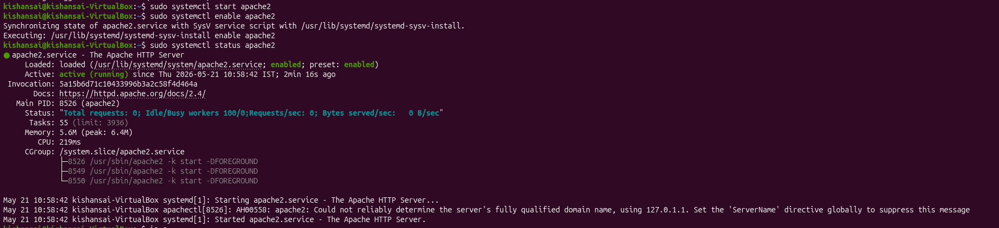

After running `systemctl status apache2`, the service showed `active (running)` — started May 21, 2026 at 10:58:42 IST. Three worker processes confirmed in the CGroup section. Apache is live on port 80 and the default `index.html` exists at `/var/www/html/index.html` — that's the target file.

---

## Network Verification

### Victim IP

```bash
ip a
```

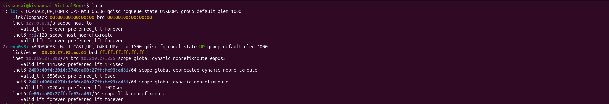

Ubuntu victim is on `10.219.27.208` via `enp0s3`. This is the target IP for the entire attack.

### Attacker IP

```bash
ip a
```


Kali attacker is on `10.219.27.131` via `eth0`. This is the source IP that shows up in every Wazuh log during the attack.

### Wazuh Server IP

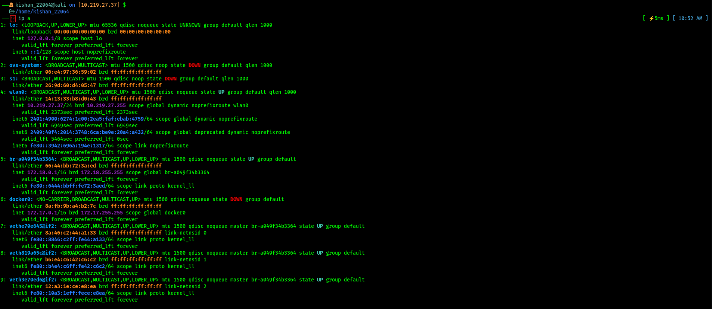

Wazuh server is at `10.219.27.37` on `wlan0`. The Docker bridge and veth interfaces visible in the output are the internal containers running the Wazuh manager stack.

---

## Phase 1 — Reconnaissance

```bash
nmap -sV 10.219.27.208
```

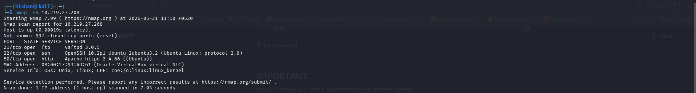

Ran a version detection scan against the victim. Three ports came back open:

- **Port 21 — vsftpd 3.0.5** — FTP from the previous lab, not used here
- **Port 22 — OpenSSH 10.2p1** — the entry point for this attack
- **Port 80 — Apache httpd 2.4.66** — the defacement target

SSH open, Apache running — that's all I needed to proceed.

---

## Phase 2 — SSH Access

```bash
ssh kishansai@10.219.27.208
```

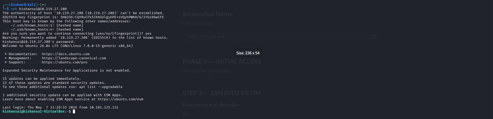

Connected from Kali, accepted the host key, authenticated with the password. The welcome banner confirmed `Ubuntu 26.04 LTS` and the prompt changed to `kishansai@kishansai-VirtualBox:~$`. Shell access on the victim is confirmed. Initial access complete.

---

## Phase 3 — Website File Enumeration

```bash
ls /var/www/html
```

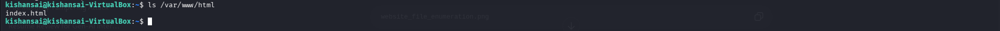

Only one file in the web root: `index.html`. That's the Apache default page currently being served at `http://10.219.27.208`. This is the file I'm going to overwrite.

---

## Phase 4 — Website Defacement

### Method 1 — Tee (Full Overwrite)

```bash
echo "HACKED BY ATTACKER" | sudo tee /var/www/html/index.html
```

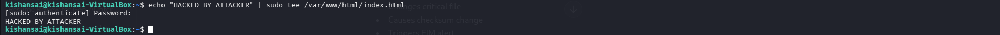

Used `tee` with `sudo` because a direct shell redirect doesn't respect sudo privileges. The command ran, printed `HACKED BY ATTACKER` to stdout confirming the write, and the file was overwritten.

**Browser result after Method 1:**
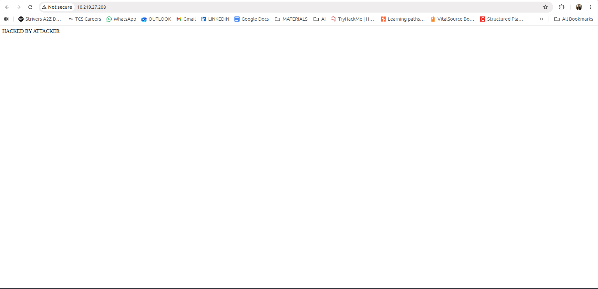


Opened a browser to `http://10.219.27.208` — the default Apache page was gone. Just `HACKED BY ATTACKER` in plain text on a white background. First defacement live.

### Method 2 — Nano (HTML Defacement)

```bash
sudo nano /var/www/html/index.html
```

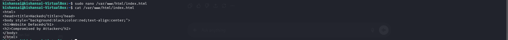

Replaced the file content with a styled HTML defacement page. After saving, ran `cat /var/www/html/index.html` to confirm the write:

```html
<html>
<head><title>Hacked</title></head>
<body style="background:black;color:red;text-align:center;">
<h1>Website Defaced</h1>
<h2>Compromised by Attacker</h2>
</body>
</html>
```

**Browser result after Method 2:**
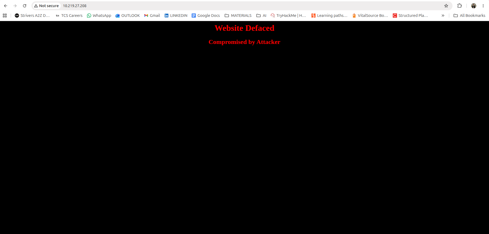


Browser refresh showed the fully styled defacement — black background, red centered text, "Website Defaced" as the heading and "Compromised by Attacker" below it. Both modifications done. Wazuh had already fired a separate Rule 550 alert for each one.

---

## Wazuh Detection

### FIM Alert — Document View

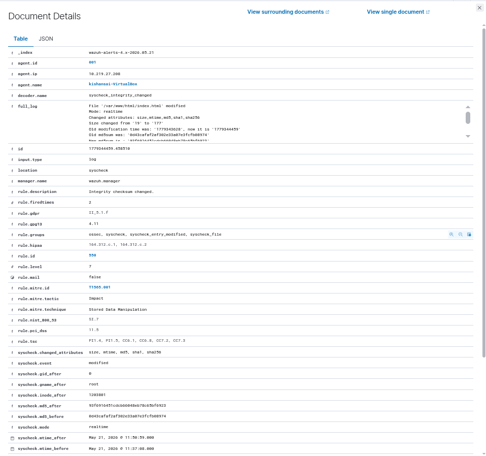

Opened the syscheck alert in Wazuh Discover. The key fields:

| Field | Value |
|---|---|
| `rule.id` | 550 |
| `rule.description` | Integrity checksum changed. |
| `rule.level` | 7 |
| `syscheck.path` | `/var/www/html/index.html` |
| `syscheck.event` | modified |
| `syscheck.changed_attributes` | size, mtime, md5, sha1, sha256 |
| `syscheck.md5_before` | `0d43cafaf2af302e33a07e3fcfb08974` |
| `syscheck.md5_after` | `93f6916451cdcb66048eb78c65bf6923` |
| `syscheck.mtime_before` | May 21, 2026 @ 11:37:08 |
| `syscheck.mtime_after` | May 21, 2026 @ 11:50:59 |
| `rule.mitre.id` | T1565.001 |
| `rule.mitre.tactic` | Impact |
| `rule.mitre.technique` | Stored Data Manipulation |

Every checksum changed. The before/after MD5 comparison proves tampering. The mtime delta shows exactly when the attacker wrote the file.

### Filtered Log View (index.html search)

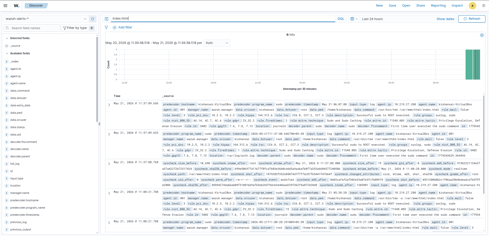

Searched for `index.html` in Discover. 6 hits — all from the two defacement operations. The histogram shows a spike right at the end of the window matching when I ran the attack. Each event includes the full source — syscheck checksums, sudo command, decoder info — all in one record.

### Wazuh Logs — Rule Timeline

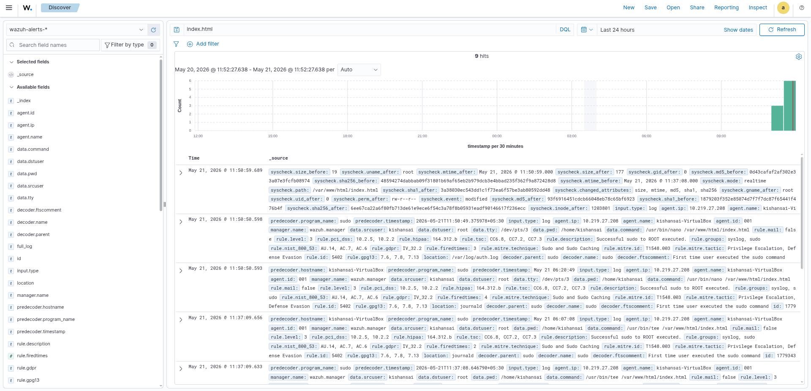

The event list shows the pattern clearly: `rule.id: 5402` (Successful sudo to ROOT) immediately followed by `rule.id: 550` (Integrity checksum changed) — twice over, matching both defacement operations. The sudo event tells you who did it and how. The syscheck event tells you what changed.

---

## Threat Hunting

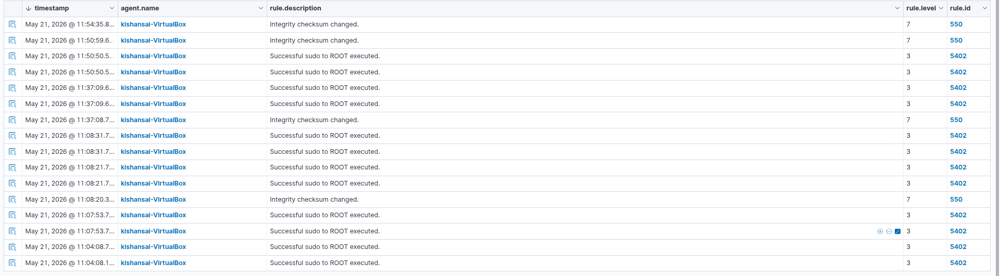

In Threat Hunting, filtering for `index.html` shows the full correlated event chain across both attacks. The journal events (sudo commands) and syscheck events (file changes) are aligned by timestamp. First cluster around 11:37 — `sudo tee`, syscheck fires at 11:37:08. Second cluster around 11:50 — `sudo nano`, syscheck fires at 11:50:59. The `data.command` field in the sudo events shows the exact binary used: `/usr/bin/tee /var/www/html/index.html` and `/usr/bin/nano /var/www/html/index.html`. `data.srcuser: kishansai` identifies the account in both.

---

## Integrity Checksum Analysis

Wazuh stores before and after checksums for every detected change. Here's the comparison from the first defacement:

| Attribute | Before | After |
|---|---|---|
| Size | 19 bytes | 177 bytes |
| MD5 | `0d43cafaf2af302e33a07e3fcfb08974` | `93f6916451cdcb66048eb78c65bf6923` |
| SHA1 | `919b22211243e37a542272b72517424` | `1879203f352e85074d7f7f7dc87f65441f476b4f` |
| mtime | 11:37:08 | 11:50:59 |

The second modification's `md5_before` matched the first modification's `md5_after` — creating an unbroken chain of evidence across both tampering events.

---

## Logs Generated

All alerts stored in index `wazuh-alerts-4.x-2026.05.21`.

### Rule IDs Observed

| Rule ID | Description | Level |
|---|---|---|
| 550 | Integrity checksum changed | 7 |
| 5402 | Successful sudo to ROOT executed | 3 |

### Raw Syscheck Log (full_log field)

```
File '/var/www/html/index.html' modified
Mode: realtime
Changed attributes: size, mtime, md5, sha1, sha256
Size changed from '19' to '177'
Old md5sum was: '0d43cafaf2af302e33a07e3fcfb08974'
New md5sum is:  '93f6916451cdcb66048eb78c65bf6923'
```

### Sudo Journal Entries

```
May 21 06:07:08 kishansai-VirtualBox sudo: kishansai : USER=root ;
  COMMAND=/usr/bin/tee /var/www/html/index.html

May 21 06:20:49 kishansai-VirtualBox sudo: kishansai : USER=root ;
  COMMAND=/usr/bin/nano /var/www/html/index.html
```

---

## MITRE ATT&CK Mapping

| MITRE ID | Technique | Tactic |
|---|---|---|
| T1046 | Network Service Discovery | Discovery |
| T1021.004 | Remote Services: SSH | Initial Access |
| T1548.003 | Sudo and Sudo Caching | Privilege Escalation, Defense Evasion |
| T1565.001 | Stored Data Manipulation | Impact |
| T1491.001 | Internal Defacement | Impact |

Wazuh auto-tagged T1565.001 and T1548.003 on the alerts. The MITRE fields appear directly in the alert documents under `rule.mitre.id`, `rule.mitre.tactic`, and `rule.mitre.technique`.

---

## Compliance Mapping

| Framework | Controls |
|---|---|
| PCI-DSS | 10.2.5, 10.2.2, 11.5 |
| HIPAA | 164.312.b, 164.312.c.1, 164.312.c.2 |
| GDPR | II_5.1.f |
| NIST 800-53 | SI.7 |
| TSC | CC6.8, CC7.2, CC7.3 |

Every Rule 550 alert came with these compliance tags auto-attached. No manual mapping needed.

---

## What I Observed

**Realtime FIM catches it in seconds.** The default scheduled scan would have missed this for hours. With `realtime="yes"`, Wazuh fired the alert within seconds of each file write. For a live web server, that gap matters.

**Both write methods were detected.** Whether I used `tee` (streaming write) or `nano` (buffered editor), Wazuh caught both. The detection is at the OS filesystem level — the tool doesn't matter.

**Sudo events + syscheck events tell the full story.** Rule 550 alone only says a file changed. Correlating with Rule 5402 reveals the account, the command, and the exact timestamp of the escalation. Together they reconstruct the entire attack in sequence.

**The checksum chain is the forensic proof.** The `md5_before` on event 2 matches the `md5_after` on event 1. That's an unbroken evidence trail showing every state the file went through.

---

## Mitigation

- **Restrict sudo for web root** — `kishansai` shouldn't have unrestricted sudo. A targeted sudoers rule excluding writes to `/var/www/html` blocks both methods used in this attack.
- **SSH key-only authentication** — Disable password auth. Stolen credentials become useless without the private key.
- **Wazuh active response** — Configure Rule 550 on `/var/www/html` to trigger an automatic alert or file restore from backup.
- **File immutability** — `chattr +i /var/www/html/index.html` prevents writes even from root until the flag is explicitly removed.

---

## Conclusion

Set up Apache, configured Wazuh realtime FIM on the web directory, gained SSH access from the attacker machine, defaced the website twice using two different methods, then investigated everything in Wazuh. Rule 550 fired on both modifications with full checksum comparisons. The correlation between sudo events (who did it, with what command) and syscheck events (what changed and when) gave a complete forensic picture of the attack from first access to final defacement.

---

## Commands Reference

### Victim — Apache Setup

```bash
sudo apt update && sudo apt install apache2 -y
sudo systemctl start apache2
sudo systemctl enable apache2
sudo systemctl status apache2
```

### Victim — Wazuh FIM Config

```bash
sudo nano /var/ossec/etc/ossec.conf
sudo systemctl restart wazuh-agent
```

```xml
<syscheck>
  <directories realtime="yes">/var/www/html</directories>
</syscheck>
```

### Attacker — Recon

```bash
ip a
nmap -sV 10.219.27.208
```

### Attacker — Access

```bash
ssh kishansai@10.219.27.208
ls /var/www/html
```

### Defacement — Method 1

```bash
echo "HACKED BY ATTACKER" | sudo tee /var/www/html/index.html
```

### Defacement — Method 2

```bash
sudo nano /var/www/html/index.html
cat /var/www/html/index.html
```

### Wazuh — Investigation Filters

```
Search: index.html
Rule filter: rule.id: 550
Path filter: syscheck.path: /var/www/html/index.html
Time range: Last 24 hours
```
