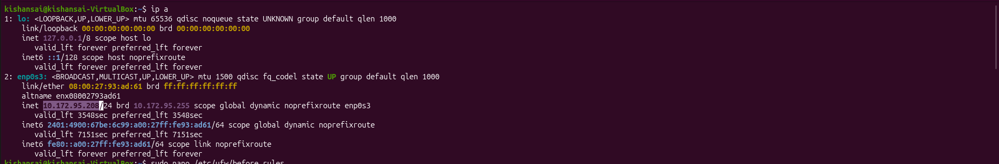
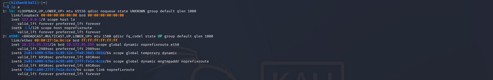
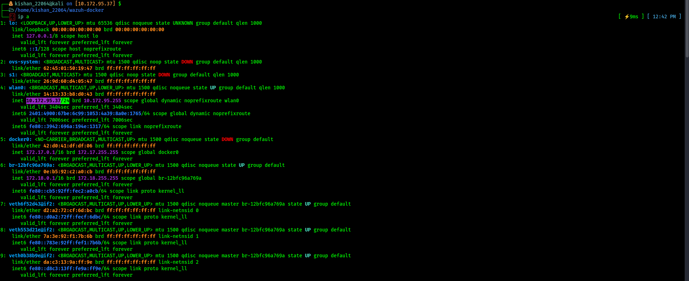
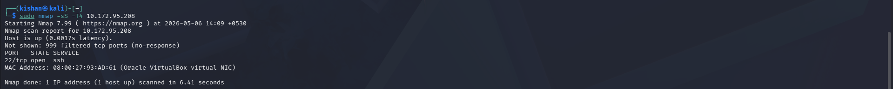
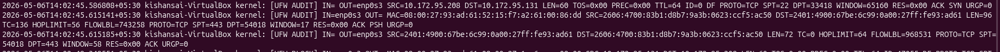
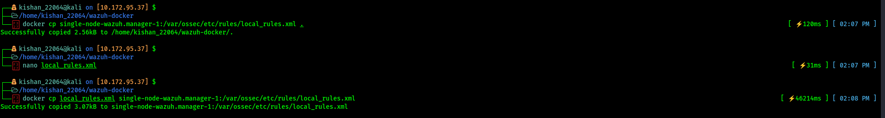
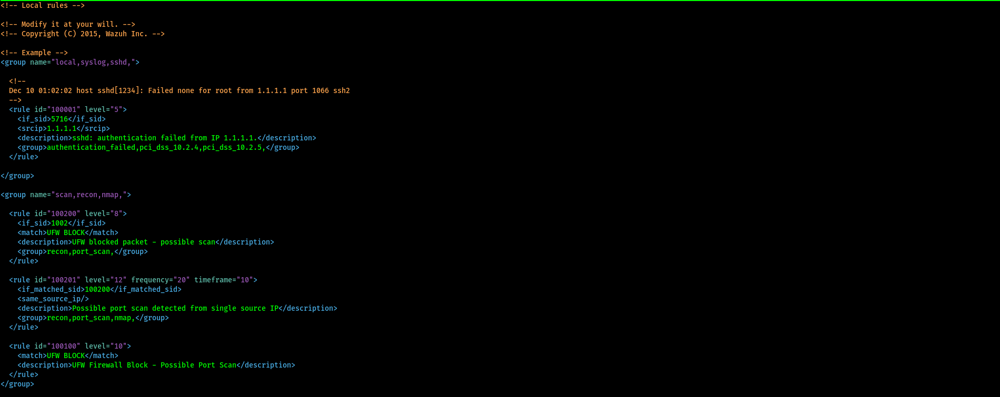
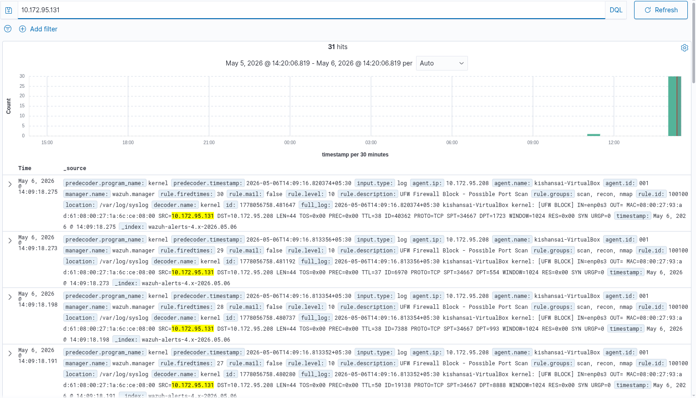

# Nmap SYN Scan Detection using Wazuh SIEM
## **Date:** 30th April & 1st May, 2026

A hands-on cybersecurity lab where I set up a small network, performed a port scan from Kali Linux, and detected it using Wazuh SIEM with a custom detection rule.

---


## Objective

- Perform a network attack (Nmap SYN Scan) from the attacker machine
- Capture the firewall logs it generates on the victim machine
- Forward those logs to Wazuh using the Wazuh Agent
- Write a custom rule so Wazuh can detect the attack
- Verify the alert appears on the Wazuh Dashboard

---

## Lab Setup

| Role         | OS              | IP Address     |
|--------------|-----------------|----------------|
| Attacker     | Kali Linux      | 10.172.95.131  |
| Victim       | Ubuntu          | 10.172.95.208  |
| Wazuh Server | Kali (Docker)   | 10.172.95.37   |

---

## Network Configuration

- All three machines were connected using **Bridged Adapter** in VirtualBox
- They are on the same subnet: `10.172.95.0/24`
- This allows direct communication between all machines without NAT

---

## IP Verification

Before starting the attack, I confirmed the IP address of each machine using `ip a`.

### Victim Machine (Ubuntu) — IP: 10.172.95.208

```bash
ip a
```



> Here I ran `ip a` on my Ubuntu victim machine to confirm its IP address before the lab. You can see the interface `enp0s3` is assigned `10.172.95.208/24` on the `10.172.95.0/24` subnet. I also noticed the MAC address `08:00:27:93:ad:61` which later showed up in the Wazuh alert logs — that was a good sanity check that the right machine was being targeted.

---

### Attacker Machine (Kali Linux) — IP: 10.172.95.131

```bash
ip a
```



> This is the `ip a` output from my Kali attacker machine. The `eth0` interface got the address `10.172.95.131/24`. Since both machines are on the same `/24` subnet, they can reach each other directly — no routing needed. I made a note of this IP because it's the one that would show up in the UFW block logs on the victim side, and I wanted to confirm alerts were actually coming from my machine.

---

### Wazuh Server (Kali with Docker) — IP: 10.172.95.37

```bash
ip a
```



> This is the Wazuh server machine running Docker. The relevant interface here is `wlan0`, which has the IP `10.172.95.37/24`. I also noticed there's a `docker0` bridge at `172.17.0.1` and a custom bridge `br-12bfc96a769a` at `172.18.0.1` — those are the internal Docker networks the Wazuh containers communicate over. The important thing was that `wlan0` was reachable from the victim machine so the agent could forward logs to the manager.

---

## Attack Execution

### Nmap SYN Scan

From the Kali attacker machine, I ran a SYN scan against the victim:

```bash
sudo nmap -sS -T4 10.172.95.208
```



> This is the actual Nmap scan I ran. I used `-sS` for a SYN (stealth) scan and `-T4` for an aggressive timing template to make it fast. The scan finished in about 6.41 seconds and found only one open port — **port 22 (SSH)**. The remaining 999 ports came back as filtered, which means UFW was silently dropping those SYN packets. That's exactly what I needed — every one of those dropped packets would generate a `UFW BLOCK` log entry on the victim, giving Wazuh something to work with.

### What a SYN Scan does

- Sends a SYN (connection request) packet to each port
- Does **not** complete the full TCP handshake
- If the port is open, the target replies with SYN-ACK
- The scanner immediately sends RST to close it before the connection completes
- This is also called a "half-open" or "stealth" scan

### Scan Result

```
PORT    STATE  SERVICE
22/tcp  open   ssh
```

- Only port 22 (SSH) was found open
- 999 other ports were filtered (blocked by UFW firewall)

---

## Log Generation

Because UFW (the firewall on the victim) blocked the scan packets, it wrote entries to the syslog.

### View UFW Logs on Victim

```bash
sudo tail -f /var/log/ufw.log
```



> I ran `sudo tail -f /var/log/ufw.log` on the victim machine to watch the logs come in live while the scan was running. What I saw was exactly what I expected — a flood of `UFW AUDIT` and `UFW BLOCK` lines, all originating from `10.172.95.131` (my Kali attacker). Each blocked SYN packet showed up as a separate log entry with the destination port it was targeting. I could literally watch the scan happening in real time just from the firewall logs, which was pretty satisfying. This confirmed the logs were being written and that the Wazuh agent would have something to pick up.

### Sample Log Entries

```
UFW BLOCK SRC=10.172.95.131 DST=10.172.95.208 DPT=3389 PROTO=TCP SYN
UFW BLOCK SRC=10.172.95.131 DST=10.172.95.208 DPT=21 PROTO=TCP SYN
UFW BLOCK SRC=10.172.95.131 DST=10.172.95.208 DPT=554 PROTO=TCP SYN
```

---

## Log Analysis

Looking at the logs, a few things stood out:

- All packets came from the **same source IP** — `10.172.95.131` (the attacker)
- They targeted **many different destination ports** in a short time
- All were **SYN-only** packets — no completed connections
- UFW blocked each one and logged it

This pattern clearly shows a **port scanning attack**.

---

## Log Flow

Here is how the logs traveled from the attack to the dashboard:

```
Nmap (Attacker)
    --> Network
        --> UFW blocks packets on Victim
            --> Syslog on Victim (/var/log/syslog)
                --> Wazuh Agent (on Victim)
                    --> Wazuh Manager (Docker on 10.172.95.37)
                        --> Wazuh Dashboard
```

---

## Issues Faced

During the implementation, several challenges were encountered.

### Issue 1 — Logs not appearing in the Wazuh Dashboard

Although the Nmap scan was successfully generating traffic, the logs were not visible in the Wazuh dashboard. Wazuh was collecting the logs but not converting them into alerts because there were no appropriate detection rules in place. This was resolved by creating custom rules in the `local_rules.xml` file to match `UFW BLOCK` events and classify them as port scan activity.

### Issue 2 — Duplicate Agent Registration Error

The agent was throwing a duplicate registration error which prevented it from connecting properly to the Wazuh manager. This was fixed by removing the existing `client.keys` file and re-registering the agent.

```bash
sudo rm -f /var/ossec/etc/client.keys
sudo /var/ossec/bin/agent-auth -m 10.172.95.37
```

### Issue 3 — No Text Editor Inside the Docker Container

While trying to edit configuration files inside the Docker container, common editors like `nano` and `vi` were not available. The workaround was to copy the file from the container to the host system, edit it locally, and then copy it back.

```bash
# Copy rules file from container to host
docker cp single-node-wazuh.manager-1:/var/ossec/etc/rules/local_rules.xml .

# Edit the file on the host
nano local_rules.xml

# Copy the edited file back into the container
docker cp local_rules.xml single-node-wazuh.manager-1:/var/ossec/etc/rules/local_rules.xml
```



> This screenshot shows me working around Issue 3. Since there was no text editor inside the Wazuh manager Docker container, I had to copy `local_rules.xml` out to the host with `docker cp`, edit it using `nano` on the host, and then copy it back in. You can see the file sizes changed between the two `docker cp` operations — from 2.56kB to 3.07kB — which confirmed that my new rules were actually saved into the file before it was pushed back. It's a simple workaround but one I hadn't thought about upfront, and it cost me a bit of time figuring it out.

Once all three issues were resolved, logs were successfully forwarded, detected, and visualized in the Wazuh dashboard.

---

## Custom Detection Rule

I wrote three rules in `local_rules.xml` to detect the port scan:



> This is the `local_rules.xml` file open in `nano` after I wrote the custom rules. You can see the full XML structure — there's the existing example rule (ID `100001`) for SSH auth failures that ships with Wazuh by default, and then my three new rules underneath in a separate `<group name="scan,recon,nmap,">` block. I grouped them under descriptive tags like `recon` and `port_scan` so they would show up properly categorized in the Wazuh dashboard. Writing this was honestly the most interesting part of the lab — figuring out the right combination of `<match>`, `<if_matched_sid>`, `frequency`, and `timeframe` attributes to make the detection both accurate and not too noisy.

```xml
<!-- Local rules -->
<!-- Modify it at your will. -->
<!-- Copyright (C) 2015, Wazuh Inc. -->

<group name="local,syslog,sshd,">
  <rule id="100001" level="5">
    <if_sid>5716</if_sid>
    <srcip>1.1.1.1</srcip>
    <description>sshd: authentication failed from IP 1.1.1.1.</description>
    <group>authentication_failed,pci_dss_10.2.4,pci_dss_10.2.5,</group>
  </rule>
</group>

<group name="scan,recon,nmap,">

  <!-- Rule 1: Fires on any single UFW BLOCK event -->
  <rule id="100200" level="8">
    <if_sid>1002</if_sid>
    <match>UFW BLOCK</match>
    <description>UFW blocked packet - possible scan</description>
    <group>recon,port_scan,</group>
  </rule>

  <!-- Rule 2: Fires when 20+ UFW BLOCK events come from the same IP within 10 seconds -->
  <rule id="100201" level="12" frequency="20" timeframe="10">
    <if_matched_sid>100200</if_matched_sid>
    <same_source_ip/>
    <description>Possible port scan detected from single source IP</description>
    <group>recon,port_scan,nmap,</group>
  </rule>

  <!-- Rule 3: General UFW BLOCK alert -->
  <rule id="100100" level="10">
    <match>UFW BLOCK</match>
    <description>UFW Firewall Block - Possible Port Scan</description>
  </rule>

</group>
```

### Rule Summary

| Rule ID | Level | What it detects |
|---------|-------|-----------------|
| 100200  | 8     | Any single UFW BLOCK event |
| 100201  | 12    | 20+ UFW BLOCK events from same IP in 10 seconds |
| 100100  | 10    | General UFW firewall block |

- **Level 8** = Medium severity
- **Level 10** = High severity
- **Level 12** = Critical — this is the port scan confirmation rule

---

## Detection Logic

### How the Attack is Identified from Logs

When Nmap sends SYN packets to each port on the victim machine, UFW intercepts and blocks the ones that have no allow rule. Each blocked packet is written as a `UFW BLOCK` entry in `/var/log/syslog`. A single `UFW BLOCK` entry is not suspicious on its own — firewalls block stray packets all the time. What makes it a port scan is the **pattern**: the same source IP generating a large number of these entries across many different destination ports within a very short time window.

The Wazuh agent reads the syslog continuously and forwards every new line to the Wazuh manager. The manager then checks each log line against all available rules. When a line contains `UFW BLOCK`, the rules written in `local_rules.xml` are triggered.

### Why Multiple SYN Packets Indicate a Port Scan

In normal network activity, a machine might occasionally have a packet blocked by a firewall — for example, a misconfigured service or a stale connection attempt. These are isolated events.

A port scan is different. Nmap sends SYN packets to hundreds or thousands of ports in a matter of seconds. This produces a flood of `UFW BLOCK` log entries, all sharing the same source IP, in a very compressed timeframe. No legitimate user or service behaves this way. The combination of:

- Same source IP across all entries
- Many different destination ports targeted
- Only SYN packets with no completed handshakes
- All events happening within seconds

...is the fingerprint of a port scan.

### How the Three Rules Work Together

The three custom rules work as a layered detection system, each serving a different purpose:

| Rule ID | Role | How it works |
|---------|------|--------------|
| 100100  | Broad catch-all | Fires on every single `UFW BLOCK` event regardless of frequency. Ensures no blocked packet goes unnoticed. Level 10. |
| 100200  | Scan pre-detection | Also fires on every `UFW BLOCK` event, but its purpose is to act as a **counter**. Each time it fires, Wazuh tracks the source IP. Level 8. |
| 100201  | Scan confirmation | Fires only when rule 100200 has been triggered 20 or more times from the **same source IP** within a 10-second window. This is the definitive port scan alert. Level 12. |

Rule 100200 acts as the building block. On its own it just says "a packet was blocked." Rule 100201 watches how often 100200 fires from the same IP and within what timeframe — when that count crosses 20 in 10 seconds, it escalates to a critical level 12 alert. Rule 100100 runs independently as a parallel, simpler alert to ensure visibility even if the frequency threshold is not reached.

Together, they provide both immediate visibility (100100) and confirmed high-confidence detection (100201).

---

## Wazuh Restart

After saving the rules file, I restarted the Wazuh manager container so it would load the new rules:

```bash
docker restart single-node-wazuh.manager-1
```

---

## Detection in Dashboard

After running the scan again, the alerts appeared in the Wazuh Dashboard.



> This is the moment everything came together. I filtered the Wazuh dashboard by the attacker IP `10.172.95.131` and got back **31 hits** — all clustered tightly at around 14:09 on May 6, 2026, which is exactly when I ran the scan. Each alert entry shows `rule.id: 100100`, `rule.level: 10`, and the description "UFW Firewall Block - Possible Port Scan". You can also see the `full_log` field in each row contains the raw `[UFW BLOCK]` syslog entry with the source IP highlighted in yellow. The spike in the histogram at the far right of the timeline is a visual confirmation of the burst pattern — all 31 events fired in a matter of seconds. Seeing this after hours of debugging the agent registration and rule syntax was genuinely satisfying.

### Alert Details

| Field          | Value                          |
|----------------|-------------------------------|
| Rule ID        | 100100                         |
| Rule Level     | 10                             |
| Description    | UFW Firewall Block - Possible Port Scan |
| Source IP      | 10.172.95.131 (Attacker)       |
| Agent          | kishansai-VirtualBox (Victim)  |
| Location       | /var/log/syslog                |
| Total Hits     | 31                             |

The dashboard showed 31 alert hits, all from the attacker IP `10.172.95.131`, in a short burst — which is exactly what a port scan looks like.

---

## Result

| Step | Status |
|------|--------|
| Attack executed (Nmap SYN Scan) | Done |
| UFW logs generated on victim | Done |
| Logs forwarded to Wazuh | Done |
| Custom detection rule created | Done |
| Attack detected in dashboard | Done |

---

## Security Insight

### Why Port Scanning is Dangerous

Port scanning by itself does not cause direct damage — it does not steal data or break systems. However, it is almost always the **first step of a real attack**. Before an attacker can exploit a vulnerability, they need to know what is running on the target. Port scanning tells them exactly that: which ports are open, which services are listening, and sometimes even the version of those services.

The danger of a port scan lies in what comes after it. An attacker who discovers an open SSH port on port 22 may then attempt brute force login attacks. An open web server port may lead to web application exploitation. An open database port may be probed for weak credentials. In other words, a port scan is the attacker's reconnaissance phase — and reconnaissance is where attacks begin.

### How Attackers Use Port Scanning in Real-World Scenarios

In real-world attacks, port scanning is used in several ways:

- **Pre-attack reconnaissance** — Attackers scan a target before launching any exploit to map out the attack surface. This is standard procedure in both targeted attacks and automated malware campaigns.
- **Identifying outdated or unpatched services** — By combining scan results with version detection (`-sV` flag in Nmap), attackers can identify services running old software with known CVEs.
- **Finding misconfigured services** — Open ports that should not be publicly accessible (like database ports, admin panels, or internal APIs) are frequently discovered through scanning.
- **Automated scanning at scale** — Tools like Masscan can scan the entire internet in under an hour. Attackers use these tools to find vulnerable targets at scale, not just to target one specific machine.
- **Internal lateral movement** — Once inside a network, attackers scan internally to discover other machines and services that may be reachable from the compromised host.

Detecting port scans early gives defenders a chance to block the attacker before any real damage is done. This is exactly what this lab demonstrates — catching the reconnaissance phase before it progresses further.

---

## What I Learnt

- **Nmap itself does not generate logs.** The firewall (UFW) generates logs when it blocks the scan packets. If there is no firewall, there may be no logs at all.
- **Logs are not the same as alerts.** Wazuh collects logs, but it only creates alerts when a rule matches. Without a rule, the logs are collected and stored, but nothing flags them as suspicious.
- **SIEM tools need rules to detect threats.** The detection is only as good as the rules written for it.
- **Docker containers are minimal by design.** They often do not have text editors. The copy-edit-copy pattern is a practical workaround.

---

## Conclusion

This lab demonstrated a complete attack-detection cycle: performing a real Nmap SYN port scan, watching UFW generate firewall block logs, forwarding those logs through the Wazuh agent to the Wazuh manager, and finally writing custom SIEM rules to detect the port scan pattern. The key lesson is that detection depends on having the right rules — raw logs alone are not enough.
