# SSH Brute Force Attack Detection using Wazuh SIEM

## **Date:** 2nd & 4th May, 2026

A hands-on cybersecurity task where I simulated SSH brute force attacks and detected them using Wazuh SIEM. I carried this out in a fully controlled virtual environment using multiple attack tools across three machines. Everything here is strictly for educational and research purposes.

---
## Task Environment

For this task, I set up three virtual machines inside VirtualBox, each with a specific role — a SIEM manager, a victim SSH server, and an attacker machine. All machines communicate over a shared internal network.

The Ubuntu machine runs OpenSSH Server and a Wazuh Agent, which forwards all authentication events to the Wazuh Manager. The Kali attacker machine launches brute force attacks using different tools to generate varied authentication log patterns.


| Role         | OS              | IP Address     |
|--------------|-----------------|----------------|
| Attacker     | Kali Linux      | 10.181.125.131  |
| Victim       | Ubuntu          | 10.181.125.208  |
| Wazuh Server | Kali (Docker)   | 10.181.125.37   |

---

---

## Objective

The goal of this task is to understand SSH brute force attacks from both the attacker's and defender's perspective. I aimed to:

- Simulate multiple SSH brute force attack scenarios using real tools
- Generate authentication failure logs and monitor them live in Wazuh
- Detect brute force activity through Wazuh's built-in detection rules
- Analyze failed and successful login attempts in Wazuh's event dashboard
- Map attack behavior to MITRE ATT&CK techniques

---

## Tools Used

**Wazuh SIEM** — An open-source security monitoring platform. I installed Wazuh on the Kali manager machine and deployed an agent on the Ubuntu victim. Every SSH login attempt was forwarded to Wazuh in near real time. Built-in rules for SSH authentication (rule IDs 5710, 5715, 5760, 5763, and 40112) let me see brute force activity and correlate events across time.

**Hydra** — A widely used network login brute force tool that supports dozens of protocols including SSH. I used it in two modes — targeting a single username, then targeting multiple usernames at once. It is fast but can be aggressive enough to cause SSH connection resets in low-resource VM environments.

**Medusa** — Another brute force tool, more stable and methodical than Hydra. I ran it with reduced threads (`-t 2`) to avoid overwhelming the virtual SSH server. It produced clear verbose output and a consistent stream of log events in Wazuh.

**Nmap** — Used in the pre-attack phase to verify that SSH was running on port 22 of the victim machine before launching any attacks.

**OpenSSH Server** — Installed on the Ubuntu victim as the target SSH service. It writes detailed authentication logs to `/var/log/auth.log` and the systemd journal, which Wazuh reads automatically.

---

## Hydra vs Medusa — Comparison

| Feature | Hydra | Medusa |
|---|---|---|
| Performance | Very aggressive by default | More controlled and steady |
| Speed | Faster with high thread counts | Slower but more reliable in VMs |
| Stability | Can cause SSH resets in VM environments | More stable with low thread counts |
| Protocol Support | 50+ protocols | ~20+ protocols |
| Logging Output | Compact, shows found credentials | Verbose mode shows every attempt clearly |
| Best Use in Labs | Good, use `-t 4` or lower in VMs | Excellent with `-t 2`, stable log stream |

In professional red team work, Hydra is preferred for speed and protocol coverage. In VM labs like this, Medusa with `-t 2` is more stable and generates cleaner logs for SIEM analysis.

---

## Lab Setup

Before any attack, I set up the victim machine by creating a dedicated user account with a weak password. This simulates a misconfigured system — the kind real attackers look for.

### Creating the Victim User

On the Ubuntu victim machine, I created a new user with a deliberately weak password:

```bash
sudo adduser victim
```

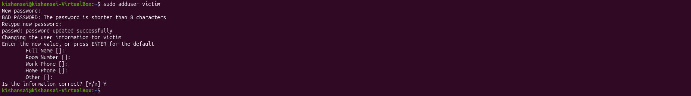

The terminal shows the `adduser victim` command being run on the Ubuntu machine. The system warned that the password is shorter than 8 characters — this is intentional. I left all other user info fields blank. The weak password (`test`) ensures the brute force tools can crack it within a small number of attempts.

### Verifying SSH Service

After creating the user, I confirmed SSH was active and listening:

```bash
sudo systemctl status ssh
```

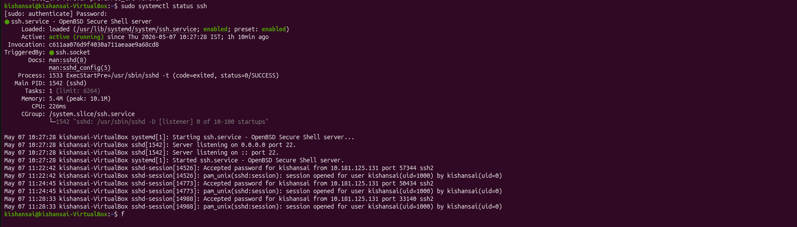

The SSH service (`ssh.service`) is shown as active on the Ubuntu victim. The output confirms the service started successfully and is listening on port 22. Journal entries also show accepted password events from `10.181.125.131` — the attacker IP — confirming SSH connectivity between the two machines was working before any attacks began.

---

## Network Verification

Before running any brute force tools, I confirmed that the SSH service was reachable from the attacker machine using two steps.

### Nmap Port Scan

I ran a service version scan against the victim to check whether port 22 was open:

```bash
nmap -sV 10.181.125.208
```

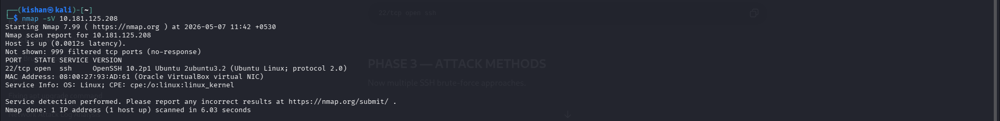

The Nmap output shows port 22 is open on `10.181.125.208`, running OpenSSH 10.2p1 on a Linux kernel. The host responded in 0.0012 seconds with no firewall interference. Nmap also identified the NIC as an Oracle VirtualBox virtual adapter, consistent with the lab environment.

### Manual SSH Login Test

With SSH confirmed open, I tested a manual login from the attacker machine to verify end-to-end connectivity:

```bash
ssh kishansai@10.181.125.208
```

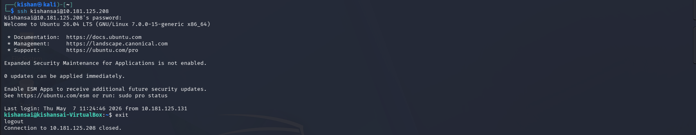

The Kali attacker machine (`10.181.125.131`) successfully authenticated to the victim (`10.181.125.208`) using valid credentials. The Ubuntu 26.04 LTS welcome banner appeared and the session was closed immediately with `exit`. This confirmed that authentication, session setup, and disconnection all worked correctly.

---

## Attack Method 1 — Manual SSH Authentication Testing

The first method was manual SSH login attempts using both correct and incorrect credentials. The goal was to verify that Wazuh was capturing authentication events before moving to automated attacks.

### Checking the Victim IP Address

```bash
ip a
```

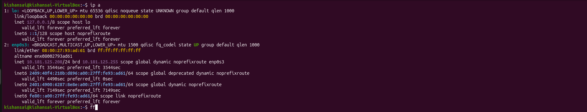

The `ip a` command on the Ubuntu victim shows the `enp0s3` interface with IP `10.181.125.208` — the target IP used in all attack commands throughout this task.

### Checking the Attacker IP Address

```bash
ip a
```

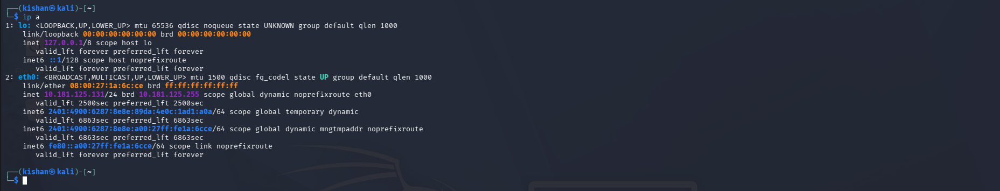

The `ip a` output on the Kali attacker shows the `eth0` interface with IP `10.181.125.131`. This is the source IP that appears in all Wazuh logs as the attacker's address.

### Performing Manual SSH Login Attempts

I made several SSH connections — some with correct credentials and some with wrong passwords — to generate both success and failure events:

```bash
ssh kishansai@10.181.125.208
```


This shows a successful SSH login from the Kali attacker to the Ubuntu victim using the `kishansai` username. Before this, I intentionally entered wrong passwords to generate authentication failure logs. Every attempt — successful or failed — was recorded by the SSH daemon and forwarded to Wazuh.

### Wazuh Dashboard — Manual SSH Events

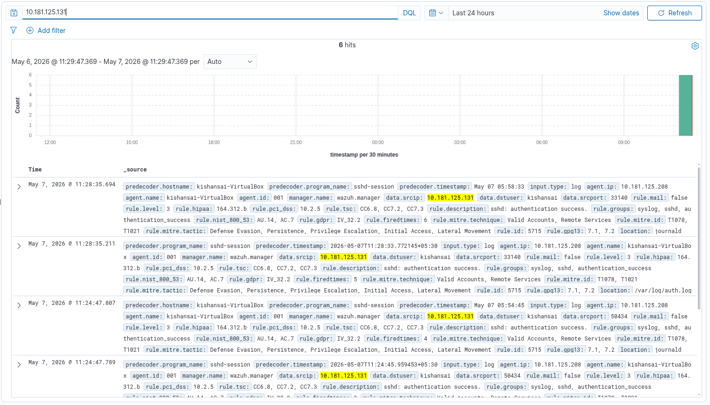

Filtering the Wazuh dashboard by `10.181.125.131` shows 6 hits in the last 24 hours. The events include authentication success events with rule ID `5715` — "sshd: authentication success." The `data.srcip` field confirms the attacker IP, `data.dstuser` shows the target username (`kishansai`), and timestamps match exactly when the connections were made.

### Wazuh Document — Auth Success Alert

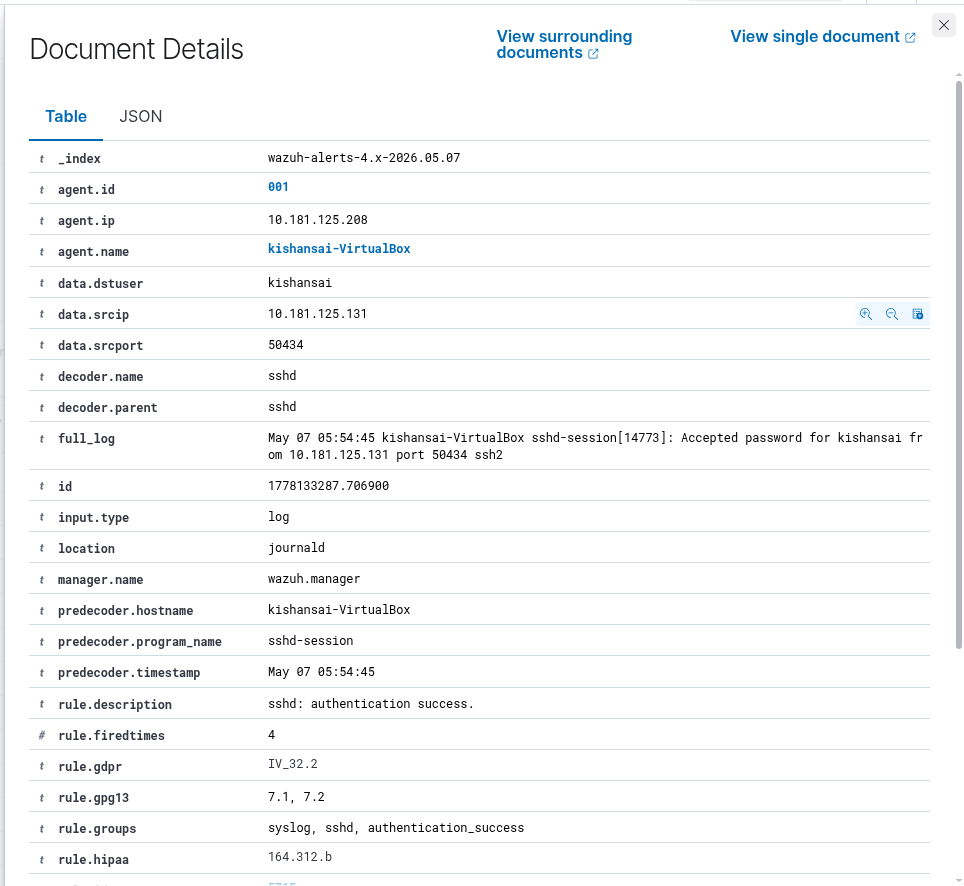

The document detail view shows the complete structured event record. Key fields include `agent.ip: 10.181.125.208` (victim), `data.srcip: 10.181.125.131` (attacker), `rule.id: 5715`, and `rule.description: sshd: authentication success.` The raw sshd log line reads: "Accepted password for kishansai from 10.181.125.131 port 50434 ssh2". Compliance tags including GDPR, HIPAA, and MITRE ATT&CK (T1078, T1021) were automatically attached by Wazuh.

---

## Attack Method 2 — Hydra Single Username Brute Force

With manual testing done, I moved to automated attacks. Hydra was used first with a single username (`victim`) and a custom password list.

### Installing Hydra and Creating the Password List

```bash
sudo apt install hydra -y
nano pass.txt
cat pass.txt
```

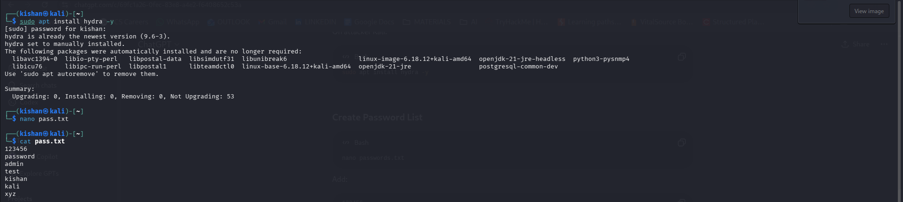

Hydra was already installed (version 9.6-3) on Kali Linux. I created the password file `pass.txt` using nano and confirmed its contents with cat. The list contains: `123456`, `password`, `admin`, `test`, `kishan`, `kali`, and `xyz`. The correct password for the `victim` account (`test`) was deliberately included to ensure Hydra would find a valid credential.

### Running the Hydra Single User Attack

```bash
hydra -l victim -P pass.txt ssh://10.181.125.208
```

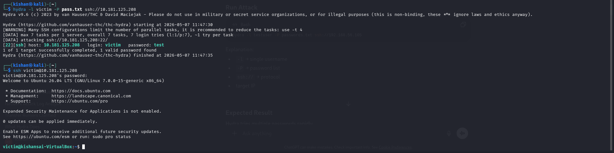

Hydra started at 11:47:30 and finished in just 5 seconds. It found the valid credentials: login: `victim` / password: `test`. After the attack, I used the discovered credentials to manually SSH into the victim machine, which confirmed Hydra's result.

### Wazuh Failed Authentication Document

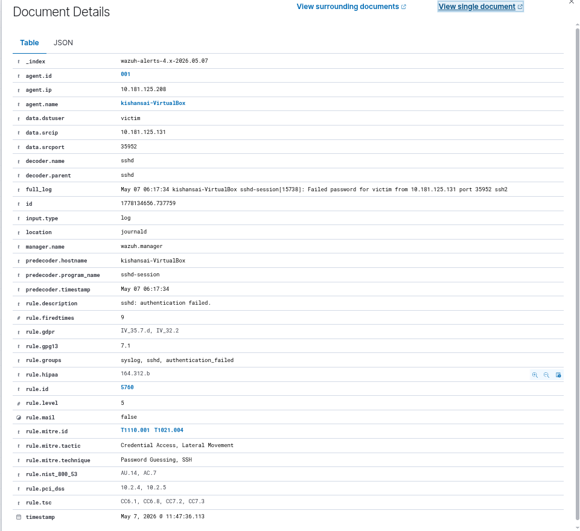

During the attack, Wazuh captured every failed attempt before the correct password was found. This document shows `rule.id: 5760` — "sshd: authentication failed." The `full_log` field contains the raw sshd message: "Failed password for victim from 10.181.125.131 port 35952 ssh2." MITRE techniques T1110.001 (Brute Force: Password Guessing) and T1021.004 (Remote Services: SSH) are both tagged. The firedtimes counter is already at 9.

### Wazuh Threat Hunting — All Logs for Attack 2

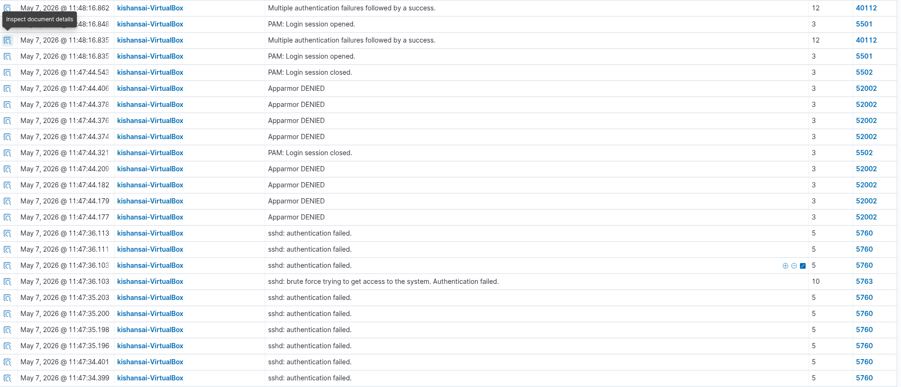

The Threat Hunting view shows the complete event chain from Hydra's attempt. At the top, rule `40112` appears with severity level 12 — "Multiple authentication failures followed by a success." This is the key alert telling a defender that a brute force attack succeeded. Below that are multiple rule `5760` (authentication failed) events, a `5763` entry for brute force detection, and PAM session events (5501, 5502) marking when the session opened and closed.

### Wazuh Filtered Log — 25 Hits

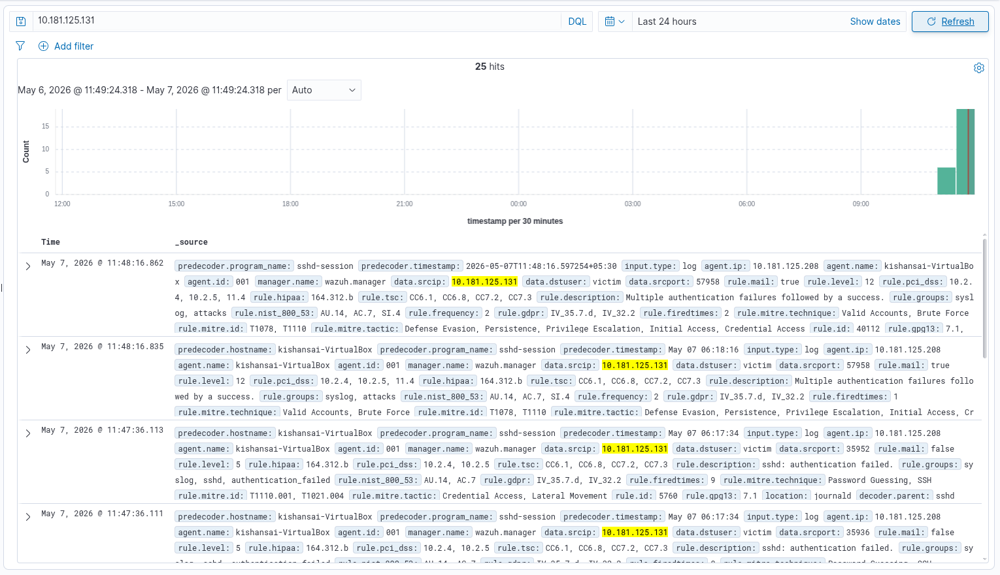

Filtering by the attacker IP after this attack shows 25 total hits — a jump from the 6 hits seen after manual testing. The spike in the histogram marks exactly when the attack happened.

### Wazuh Document — Severity 12 Alert

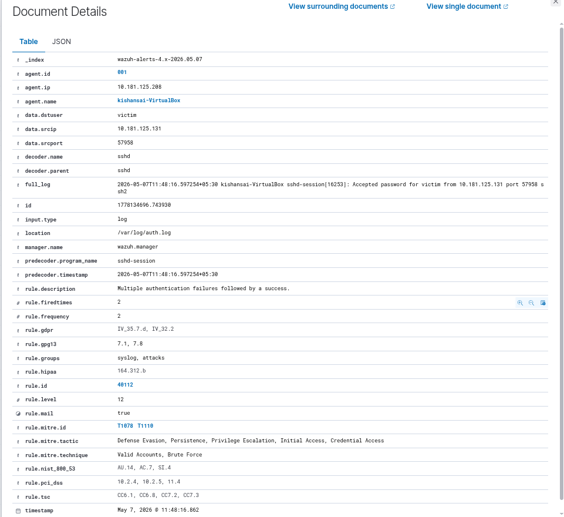

This document shows `rule.id: 40112`, `rule.level: 12`, and `rule.description: Multiple authentication failures followed by a success.` This composite rule fires when Wazuh detects a pattern of failures immediately followed by a success — the textbook signature of a successful brute force. The `rule.mail: true` field means this alert would send an email notification in a production environment. Rule level 12 is a high-severity alert in Wazuh's scoring system.

---

## Attack Method 3 — Hydra Multi-User Brute Force

I escalated the scope by targeting multiple usernames at once. This simulates an attacker who doesn't know which accounts exist on a system and tries a list of common usernames against a list of common passwords.

### Running Hydra with Username and Password Lists

I created a `users.txt` file with multiple common usernames and ran Hydra with both files. The thread count was reduced to `-t 1` to avoid connection resets on the virtual SSH server:

```bash
hydra -L users.txt -P pass.txt -t 1 ssh://10.181.125.208
```

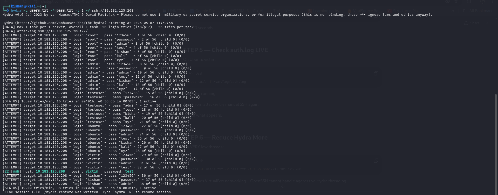

Hydra made 56 total attempts (8 usernames × 7 passwords). The username list included `root`, `admin`, `testuser`, `ubuntu`, `victim`, `kishan`, and others. The correct credential `victim:test` was found at attempt 32. The reduced thread count was necessary because OpenSSH in VM environments resets connections when too many simultaneous authentication requests arrive.

### Shell Access After Successful Brute Force

```bash
ssh victim@10.181.125.208
```

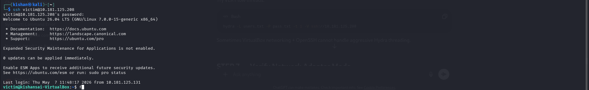

After Hydra found the credentials, I opened a shell session to the victim machine to confirm the result. The Ubuntu 26.04 LTS welcome message appeared and the shell prompt shows `victim@kishansai-VirtualBox:~$`, confirming a full interactive session. The login timestamp shows the connection came from `10.181.125.131`.

### Wazuh Filtered Log — 271 Hits

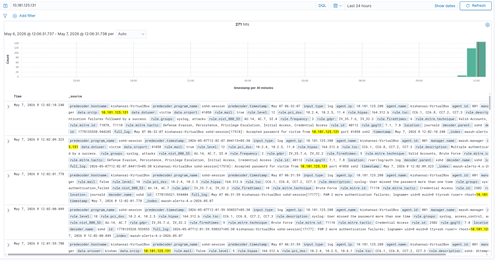

After this attack, filtering by the attacker IP shows 271 hits — up from 25 in Attack 2. The histogram spike clearly marks when the multi-user brute force ran. Events include rule `40112` (multiple failures followed by success), rule `5710` (attempt to login with non-existent user), and rule `5760` (authentication failed).

### Wazuh Threat Hunting — Multi-User Attack Events

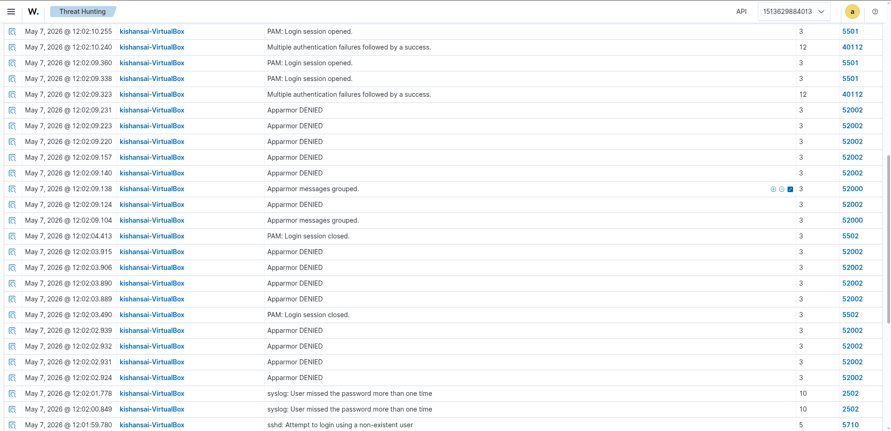

The Threat Hunting log shows events including PAM: Login session opened (5501), PAM: Login session closed (5502), Multiple authentication failures followed by a success (40112), and multiple instances of "sshd: Attempt to login using a non-existent user" (5710). The non-existent user alerts appeared because the username list included accounts like `root` and `admin` that do not exist on the victim machine — each attempt was flagged separately.

### Wazuh Document — Successful Brute Force (Multi-User)

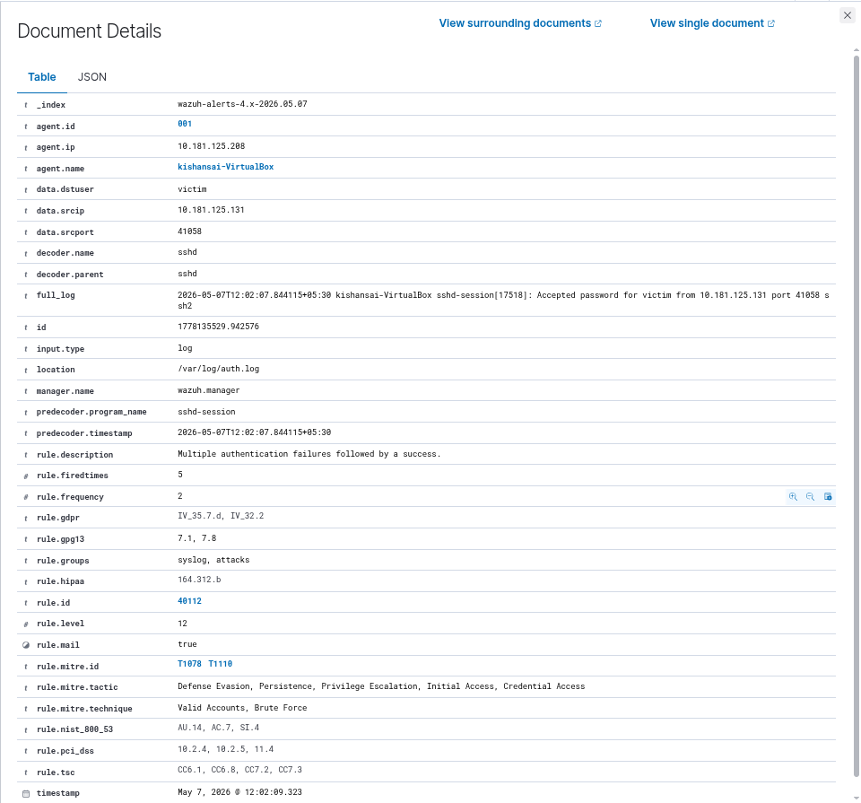

This document again shows `rule.id: 40112`, `rule.level: 12`. The `full_log` shows: "Accepted password for victim from 10.181.125.131 port 41058 ssh2." The firedtimes counter is at 5, meaning Wazuh tracked 4 previous instances of this pattern in the current session.

---

## Attack Method 4 — Medusa SSH Brute Force

The final method used Medusa instead of Hydra. I ran it with very low threads (`-t 2`) for VM stability and to generate a clean stream of authentication log events.

### Running the Medusa Attack

```bash
medusa -h 10.181.125.208 -U users.txt -P pass.txt -M ssh -t 2 -v 6
```

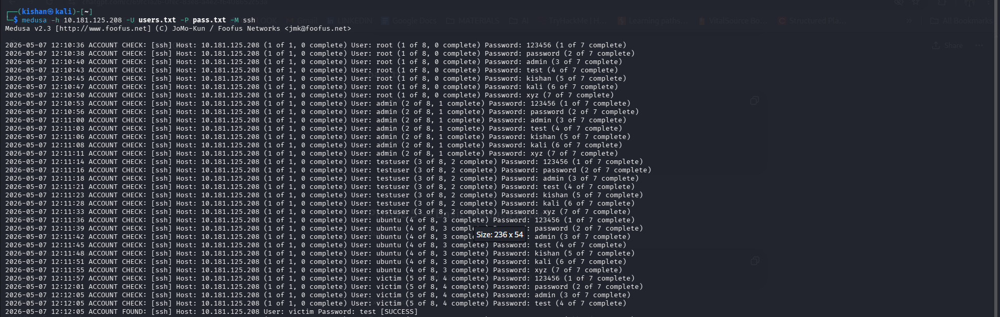

The Medusa v2.3 output is highly verbose (due to `-v 6`) and shows every authentication attempt in timestamped rows. Each line follows the format: `ACCOUNT CHECK: [ssh] Host: 10.181.125.208 (1 of 1) User: <username> Password: <password>`. It worked through all 56 combinations (8 usernames × 7 passwords). The final result: `ACCOUNT FOUND: [ssh] Host: 10.181.125.208 User: victim Password: test [SUCCESS]`.

### Wazuh Filtered Log — 451 Hits

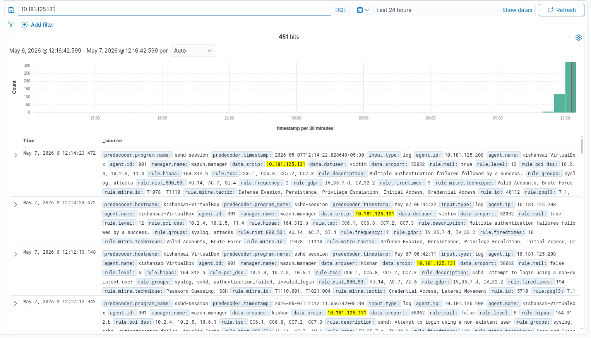

The Medusa attack generated 451 total hits — the highest of all methods. Medusa's lower thread count caused each attempt to produce more individual connection and authentication events per try. The histogram spike clearly marks the Medusa attack window.

### Wazuh Threat Hunting — Medusa Events

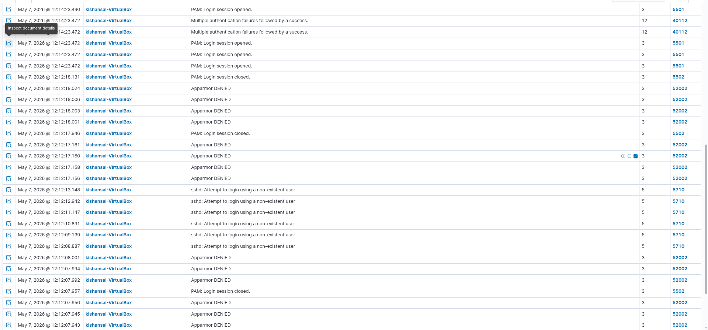

The Threat Hunting log shows the same rule categories as the Hydra multi-user attack: PAM login sessions (5501, 5502), Multiple authentication failures followed by a success (40112), Apparmor DENIED (52002), and non-existent user attempts (5710). Regardless of which tool is used, the same rule IDs fire in Wazuh — detection is based on behavior, not the specific tool.

### Wazuh Document — Medusa Success Alert

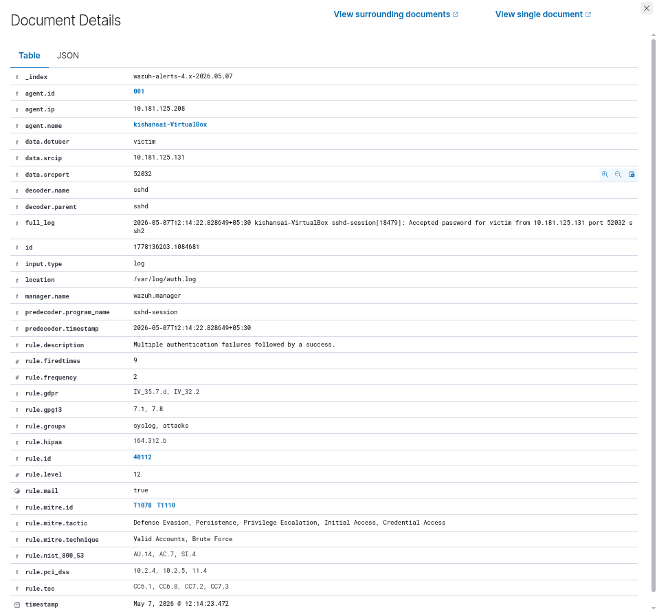

This document shows `rule.id: 40112`, `rule.level: 12`. The `data.srcip: 10.181.125.131` identifies the attacker, `data.dstuser: victim` shows the target account, and the `full_log` reads: "Accepted password for victim from 10.181.125.131 port 52032 ssh2." The `rule.firedtimes: 9` shows Wazuh tracked this pattern 9 times across all attack sessions. Compliance fields (PCI-DSS, HIPAA, GDPR) and MITRE tags (T1078, T1110) are all auto-populated.

---

## Log Analysis Using Wazuh

Throughout all four attack methods, Wazuh acted as the central monitoring point — collecting every authentication event from the Ubuntu victim and turning raw log lines into structured, searchable, and alertable security events.

The Ubuntu victim machine runs a Wazuh Agent (agent ID: 001, named `kishansai-VirtualBox`) that reads from both `/var/log/auth.log` and the systemd journal. Every time the SSH daemon wrote an authentication event, the agent forwarded it to the Wazuh Manager. The Manager decoded the event using the `sshd` decoder, matched it against the built-in rule set, and stored it in the OpenSearch index `wazuh-alerts-4.x-2026.05.07`.

### Key Wazuh Rule IDs Observed

| Rule ID | Description | Severity |
|---|---|---|
| 5710 | sshd: Attempt to login using a non-existent user | 5 |
| 5715 | sshd: authentication success | 3 |
| 5760 | sshd: authentication failed | 5 |
| 5763 | sshd: brute force trying to get access to the system | 10 |
| 40112 | Multiple authentication failures followed by a success | 12 |
| 2502 | syslog: User missed the password more than one time | 10 |
| 5501 | PAM: Login session opened | 3 |
| 5502 | PAM: Login session closed | 3 |

Rule 40112 at severity 12 is the most critical — it fires only when multiple failures are followed by a success from the same source, which is the direct signature of a successful brute force attack.

### Event Volume by Attack Method

| Attack Method | Tool | Wazuh Event Count |
|---|---|---|
| Method 1 — Manual SSH | Manual | 6 hits |
| Method 2 — Hydra Single User | Hydra | 25 hits |
| Method 3 — Hydra Multi-User | Hydra | 271 hits |
| Method 4 — Medusa Multi-User | Medusa | 451 hits |

### MITRE ATT&CK Mapping

| MITRE ID | Technique | Tactic |
|---|---|---|
| T1110 | Brute Force | Credential Access |
| T1110.001 | Password Guessing | Credential Access |
| T1078 | Valid Accounts | Defense Evasion, Persistence, Initial Access |
| T1021.004 | Remote Services: SSH | Lateral Movement |

---

## What I Observed

**Weak passwords are cracked in seconds.** The `victim` account used the password `test` — just 4 characters. Both Hydra and Medusa found it almost immediately. I included it in a 7-entry password list and it was discovered within the first few attempts.

**Every failed attempt shows up in Wazuh.** Even with a small password list and a handful of usernames, I saw hundreds of events logged. A single source IP generating that many authentication failures in a short window is a very obvious pattern for any defender to spot.

**Hydra vs Medusa behaved differently in the VM.** Hydra's default threading caused SSH connection resets. I had to drop it to `-t 1` to stabilize it. Medusa with `-t 2` ran cleanly without any resets and produced more consistent logs.

**The tool used doesn't matter for detection.** I switched between Hydra and Medusa across different attack methods and the same Wazuh rule IDs fired every time. Wazuh detects the behavior — not the specific tool — so changing tools would not evade detection.

**Rule 40112 is what I watched for.** This rule at severity 12 fired every time a brute force succeeded. It specifically looks for multiple failures followed by a success from the same IP, which is exactly the pattern all four of my attack methods produced.

**Non-existent usernames get flagged separately.** When I used a username list containing accounts that didn't exist on the victim machine (like `root`, `admin`), Wazuh logged those as rule 5710 — separate from the standard failed password events. This gave an even clearer picture of what I was doing.

---

## Conclusion

This task gave me a clear view of SSH brute force attacks from both sides. I ran four attack methods — manual testing, Hydra single-user, Hydra multi-user, and Medusa — and watched every attempt appear in Wazuh in near real time. Rule 40112 fired each time a brute force succeeded, and MITRE ATT&CK techniques were tagged automatically. The main takeaway is that weak passwords and no account lockout policy make brute force attacks trivially easy, and a properly configured SIEM catches them immediately.

---

## Commands Reference

### Victim Machine Setup

```bash
# Add a new user on the victim machine
sudo adduser victim

# Check IP address of victim
ip a

# Verify SSH service status
sudo systemctl status ssh

# Install OpenSSH Server if not already installed
sudo apt install openssh-server -y

# Enable SSH service on startup
sudo systemctl enable ssh

# Start SSH service
sudo systemctl start ssh

# Monitor authentication logs live
sudo tail -f /var/log/auth.log
```

### Attacker Machine — Network Verification

```bash
# Check attacker IP address
ip a

# Run Nmap service scan on victim
nmap -sV 10.181.125.208

# Test manual SSH connection
ssh kishansai@10.181.125.208
```

### Attacker Machine — Hydra Setup

```bash
# Install Hydra
sudo apt install hydra -y

# Create password list
nano pass.txt

# View password list
cat pass.txt

# Create username list
nano users.txt

# View username list
cat users.txt
```

### Attack Method 2 — Hydra Single User

```bash
hydra -l victim -P pass.txt ssh://10.181.125.208
```

### Attack Method 3 — Hydra Multi-User

```bash
# Use -t 4 or lower in VM environments to avoid SSH connection resets
hydra -L users.txt -P pass.txt -t 1 ssh://10.181.125.208
```

### Attack Method 4 — Medusa

```bash
# -t 2 keeps threading low for VM stability. -v 6 enables full verbose output
medusa -h 10.181.125.208 -U users.txt -P pass.txt -M ssh -t 2 -v 6
```
