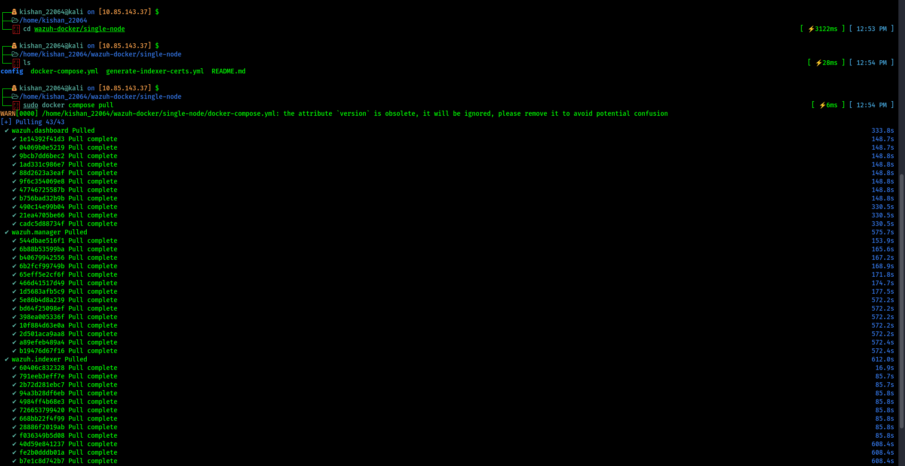

# Wazuh SIEM Setup Using Docker
### Log Monitoring & Security Event Analysis

---

## 1. Objective

In this task, I set up a **Wazuh SIEM (Security Information and Event Management)** system using Docker and connected it with a live agent to monitor real-time system activities on a separate Ubuntu machine.

The main goals were:

- Understand how a SIEM system actually works in a real environment — not just theory
- Collect logs from an endpoint (the Ubuntu agent machine) and send them to the Wazuh server
- Detect real security events such as failed login attempts, sudo usage, and system anomalies
- Visualize and investigate those events through the Wazuh Dashboard

Rather than just installing tools and taking screenshots, I focused on building a **complete end-to-end workflow: Log Generation → Collection → Analysis → Visualization** and making sure I understood each step before moving to the next.

---

## 2. Environment

| Component | Details |
|---|---|
| Wazuh Server | Docker on Kali Linux |
| Wazuh Agent | Ubuntu Virtual Machine |
| Server IP | `10.85.143.37` |
| Agent Name | `ubuntu-agent` |

---

## 3. Tools Used

- Docker & Docker Compose
- Wazuh SIEM (v4.10.3)
- Linux — Kali (server) & Ubuntu (agent)
- Web Browser — for accessing the Wazuh Dashboard

---

## 4. Step-by-Step Setup

---

### Step 1 — Install Docker

```bash
sudo apt install docker.io docker-compose -y
```

The first thing I did was install Docker and Docker Compose on my Kali Linux machine. Docker is needed because Wazuh runs all its components — the Manager, Indexer, and Dashboard — as separate containers. Instead of manually installing and configuring each service, Docker lets everything run in an isolated, pre-configured environment.

During installation, I could see it was pulling in all the required dependencies automatically. Once done, `docker.io` and `docker-compose` were both ready to use.

> **Why Docker?** It saves a huge amount of time. Wazuh has multiple services that need to work together — Docker handles all of that complexity through a single compose file.


---

### Step 2 — Start the Docker Service

```bash
sudo systemctl start docker
sudo systemctl enable docker
```

After installing Docker, I started the Docker service and enabled it so it automatically starts on every reboot. This is an important step — if Docker isn't running, none of the Wazuh containers will come up.

The `enable` command creates a systemd symlink so the service persists across reboots without needing to manually start it each time.


---

### Step 3 — Clone the Wazuh Docker Repository

```bash
git clone --branch v4.10.3 https://github.com/wazuh/wazuh-docker.git
cd wazuh-docker/single-node
```

Instead of building everything from scratch, Wazuh provides an official Docker setup on GitHub. I cloned the repository at the specific tag `v4.10.3` to ensure I was using a stable, version-matched setup.

After cloning, I navigated into the `single-node` directory. This configuration runs all Wazuh components — Manager, Indexer, and Dashboard — on a single machine, which is perfect for a home lab or learning environment.

> **Note:** I noticed it put me in a "detached HEAD" state since I checked out a tag. That's completely normal — it just means I'm on an exact version rather than a branch.


---

### Step 4 — Pull the Docker Images

```bash
sudo docker compose pull
```

Before starting the containers, I pulled all the required Docker images. Running this command first is good practice — it downloads everything in advance so the actual startup is faster and cleaner.

I could see three main images being pulled:
- `wazuh.dashboard` — the web UI
- `wazuh.manager` — the core engine that processes alerts
- `wazuh.indexer` — stores and indexes all the log data

Each image pulled its layers and confirmed completion. The whole process took a few minutes since the images are fairly large.



---

### Step 5 — Generate SSL Certificates

```bash
sudo docker compose -f generate-indexer-certs.yml run --rm generator
```

This step generates the SSL/TLS certificates that Wazuh uses for encrypted communication between its internal services — the Manager, Indexer, and Dashboard all need to talk to each other securely.

I ran the generator using a separate compose file (`generate-indexer-certs.yml`) that spins up a temporary container just to create the certificates, then removes itself (`--rm`). In the output, I could see it generating root, admin, indexer, filebeat, and dashboard certificates one by one.

> **Why this matters:** Without valid certificates, the Wazuh services refuse to communicate with each other. This is a mandatory step before starting the stack.


---

### Step 6 — Start the Wazuh Stack

```bash
sudo docker compose up -d
```

With the images pulled and certificates ready, I started all the Wazuh services using Docker Compose in detached mode (`-d`), meaning they run in the background without locking my terminal.

In the output, I could see Docker creating all the named volumes first — things like `wazuh_queue`, `wazuh_logs`, `wazuh_etc` — and then starting the three containers:
- `single-node-wazuh.manager-1`
- `single-node-wazuh.indexer-1`
- `single-node-wazuh.dashboard-1`

All three reported `Started` successfully.


---

### Step 7 — Verify All Containers Are Running

```bash
sudo docker ps
```

After starting the services, I ran `docker ps` to confirm that all three containers were actually up and healthy — not just started but actively running.

The output showed all containers with `Up` status and the ports they were listening on:
- Dashboard on port `443` (HTTPS web UI)
- Manager on ports `1514`, `1515`, `55000` (agent communication)
- Indexer on port `9200` (data storage API)

Seeing all three containers running confirmed the Wazuh stack was fully operational.


---

### Step 8 — Check Indexer Logs

```bash
sudo docker logs -f single-node-wazuh.indexer-1
```

To make sure the Indexer was actually working internally — not just running as a container — I tailed its logs using `docker logs -f`. This streams live log output directly from the container.

The logs showed the OpenSearch engine initialising, loading TLS certificates, enabling security plugins, and confirming the cluster name as `opensearch`. It also showed TLS protocols being enabled and all security configurations applying correctly.

> This step helped me confirm the system wasn't just "running" — it was actively processing and ready to receive data.


---

## 5. Agent Configuration

With the Wazuh server fully running, the next step was setting up the agent on my Ubuntu VM. The agent is responsible for collecting logs from the endpoint and forwarding them to the Wazuh Manager.

---

### Step 9 — Install the Wazuh Agent

```bash
sudo apt install wazuh-agent -y
```

On the Ubuntu VM, I installed the Wazuh agent using `apt`. The agent fetched from the official Wazuh package repository and installed cleanly. The installation output confirmed version `4.14.5-1` was being set up — though I quickly noticed this didn't match my server version.


---

### Step 10 — Fix the Version Mismatch

```bash
wget https://packages.wazuh.com/4.x/apt/pool/main/w/wazuh-agent/wazuh-agent_4.10.3-1_amd64.deb
```

The `apt` repository installed a newer version (`4.14.5`) instead of `4.10.3` which my server was running. Wazuh requires the agent and server versions to match exactly — a mismatch causes connection issues.

I solved this by directly downloading the correct `.deb` package for `v4.10.3` from the Wazuh package server using `wget`. The download completed in about 1.5 seconds at 7.21 MB/s, confirming the correct file was saved.

> **Lesson learned:** Always pin your agent version to match your server. Don't assume `apt` will give you the right one.


---

### Step 11 — Configure, Enable and Start the Agent

```bash
sudo nano /var/ossec/etc/ossec.conf
sudo systemctl enable wazuh-agent
sudo systemctl start wazuh-agent
```

Before starting the agent, I edited the `ossec.conf` file to point it at my Wazuh Manager's IP address (`10.85.143.37`). Without this, the agent wouldn't know where to send its logs.

Then I enabled the service so it starts automatically on reboot, and started it immediately. The terminal confirmed a systemd symlink was created, meaning the agent is now persistent.


---

### Step 12 — Register the Agent with the Manager

```bash
sudo /var/ossec/bin/agent-auth -m 10.85.143.37 -A ubuntu-agent
```

This is the key step that formally connects the agent to the server. The `agent-auth` tool sends a registration request to the Wazuh Manager, which issues a unique authentication key back to the agent.

In the output I could see exactly what happened:
1. The agent started and sent a key request to `10.85.143.37`
2. The server responded and confirmed the agent name `ubuntu-agent`
3. A valid key was received and the connection was established

From this point on, the agent was officially registered and actively sending logs to the Manager.


---

## 6. Dashboard & Log Analysis

With both the server and agent running, I opened the Wazuh Dashboard to see everything in action.

---

### Step 13 — Access the Wazuh Dashboard

```
https://10.85.143.37
```

I navigated to the server IP in the browser over HTTPS. The Wazuh Dashboard loaded and immediately showed a clear overview of the environment.

On the dashboard I could see:
- **Agents Summary** — 1 Active, 1 Disconnected (my `ubuntu-agent` was live)
- **Last 24 Hours Alerts** — 105 Medium severity, 153 Low severity events already detected
- Sections for Endpoint Security, Threat Intelligence, Security Operations, and Cloud Security — showing just how much Wazuh monitors out of the box

The fact that it already had hundreds of events within minutes of the agent connecting showed the system was working perfectly.


---

### Step 14 — Explore Logs in the Discover View

**Filter applied:**
```
agent.name: "ubuntu-agent"
```

In the Discover tab, I filtered all logs down to just my `ubuntu-agent`. This is where I could see every individual event in full detail — structured as key-value fields like `agent.name`, `rule.description`, `data.srcuser`, `rule.mitre.tactic`, and more.

Looking through the logs, I verified whether logs are actually coming from my Ubuntu agent to the Wazuh server.


Each log entry was timestamped and fully searchable, making it easy to trace exactly what happened and when.


---

### Step 15 — Detect Failed Login Attempts

The Discover view clearly showed Wazuh catching real security-relevant events as they happened. I could see failed login attempts flagged with `rule.description: PAM: User login failed` and mapped to the MITRE ATT&CK framework under **Credential Access** with technique `T1110.001 — Password Guessing`.

For testing, I performed some actions like failed logins and command executions, and I was able to see the following events in the dashboard:

- **PAM Login session opened** — this confirmed that a user successfully logged into the system  
- **First time user executed sudo** — this showed that a user tried to gain higher privileges  
- **PAM: User login failed** — this confirmed a failed login attempt  
- **Password check failed** — another indication of incorrect password attempts  

These logs helped me confirm that:
- The agent is properly sending logs to the server  
- Wazuh is correctly detecting and recording system activities  
- Real-time monitoring is working as expected  

This step was important to ensure that the entire setup is working correctly.

This means Wazuh isn't just collecting raw logs — it's actively correlating them against known attack patterns and classifying them automatically.


---

## 7. Conclusion

This task helped me understand how a SIEM system works in a practical way.

- Logs from the Ubuntu machine were successfully sent to the Wazuh server  
- Wazuh was able to detect events like failed logins and system activities automatically  
- The dashboard made it easy to view and understand what is happening in the system  

The most interesting part was seeing real-time logs from my own system appear in the dashboard after performing actions like wrong login attempts and commands.

Overall, this task gave me a clear idea of how monitoring and security analysis is done in real environments.
