# Wazuh SIEM Setup Using Docker
### Log Monitoring & Security Event Analysis

---

## 1. Objective

In this project, I set up a **Wazuh SIEM (Security Information and Event Management)** system using Docker and connected it with an agent to monitor real-time system activities.

The main goals were:

- Understand how SIEM works in a real-world environment
- Collect logs from an endpoint (agent machine)
- Detect security events like failed login attempts, command execution, and anomalies
- Visualize everything neatly through the Wazuh Dashboard

Rather than just installing tools, I focused on building a **complete end-to-end workflow: Log Generation → Collection → Analysis → Visualization**.

---

## 2. Environment

| Component | Details |
|---|---|
| Wazuh Server | Docker on Kali Linux |
| Wazuh Agent | Ubuntu Virtual Machine |
| Server IP | `10.85.143.37` |
| Agent Name | `ubuntu-agent` |

---

## 3. Tools Used

- Docker & Docker Compose
- Wazuh SIEM (v4.10.3)
- Linux — Kali & Ubuntu
- Web Browser (Dashboard access)

---

## 4. Step-by-Step Setup

---

### Step 1 — Install Docker

```bash
sudo apt install docker.io docker-compose -y
```

I installed Docker and Docker Compose to run Wazuh as containers. Once the installation finished, all required dependencies were automatically configured.

> **What I learned:** Docker lets you run all Wazuh components (Manager, Indexer, Dashboard) in isolated containers without complex manual installation.

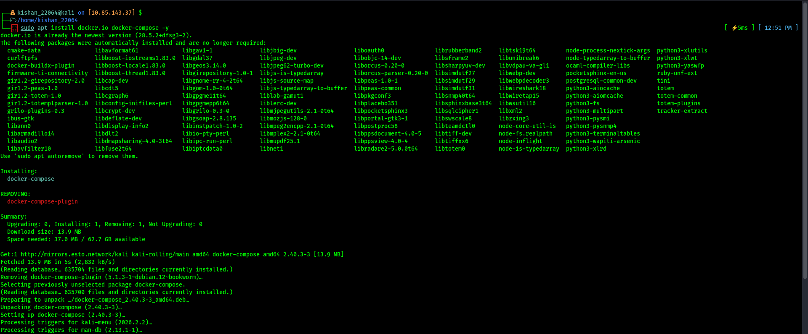

---

### Step 2 — Start the Docker Service

```bash
sudo systemctl start docker
sudo systemctl enable docker
```

I started Docker and enabled it to launch automatically on system boot. This ensures Wazuh starts up properly every time.

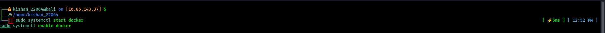

---

### Step 3 — Clone the Wazuh Repository

```bash
git clone --branch v4.10.3 https://github.com/wazuh/wazuh-docker.git
cd wazuh-docker/single-node
```

I cloned the official Wazuh Docker repository (version `v4.10.3`) and navigated into the `single-node` setup directory, which is ideal for a standalone lab environment.

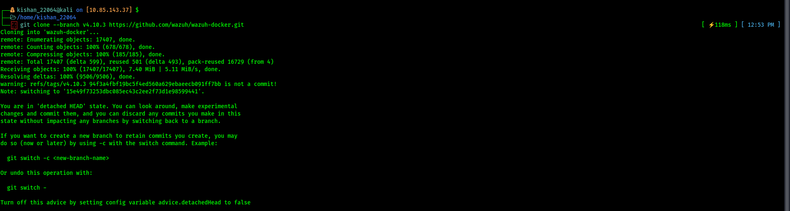

---

### Step 4 — Pull Docker Images

```bash
sudo docker compose pull
```

This pulled all necessary Docker Images including the Wazuh Manager, Indexer, and Dashboard. All three Images downloaded successfully.


---

### Step 5 — Generate SSL Certificates

```bash
sudo docker compose -f generate-indexer-certs.yml run --rm generator
```

I generated SSL certificates required for secure, encrypted communication between the Wazuh components.

> **Why it matters:** Without certificates, the services can't communicate securely with each other.

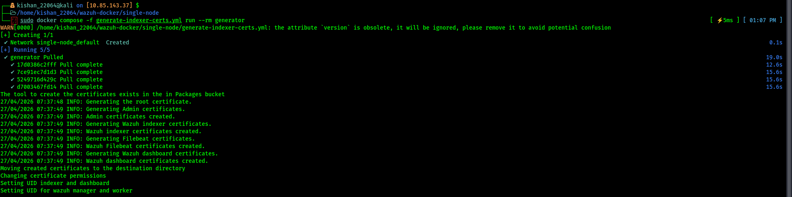

---

### Step 6 — Start Wazuh Services

```bash
sudo docker compose up -d
```

I launched all the Wazuh containers in detached mode. All services came up cleanly in the background.

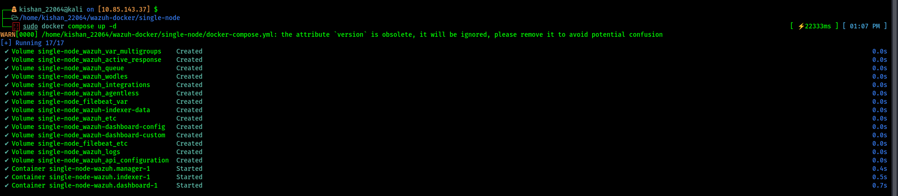

---

### Step 7 — Verify Running Containers

```bash
sudo docker ps
```

I verified that all containers were running and that the necessary ports were properly exposed.

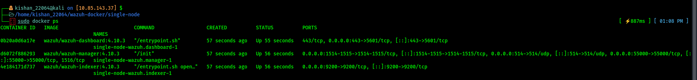

---

### Step 8 — Check Indexer Logs

```bash
sudo docker logs -f single-node-wazuh.indexer-1
```

I tailed the indexer logs to confirm it was generating data continuously. The logs confirmed the system was functioning normally.

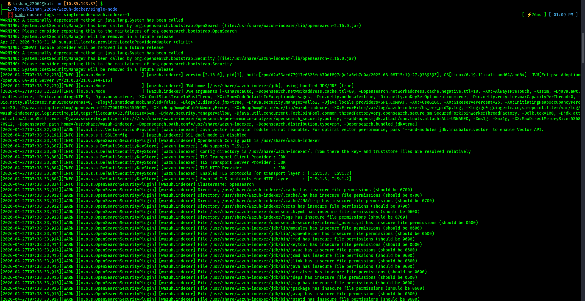

---

## 5. Agent Configuration

Now that the Wazuh server was running, I set up an agent on the Ubuntu VM to start sending logs.

---

### Step 9 — Install Wazuh Agent

```bash
sudo apt install wazuh-agent -y
```

I installed the Wazuh agent on the Ubuntu machine to start forwarding logs to the server.

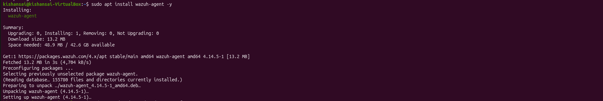

---

### Step 10 — Fix Agent Version Mismatch

```bash
wget https://packages.wazuh.com/4.x/apt/pool/main/w/wazuh-agent/wazuh-agent_4.10.3-1_amd64.deb
```

The default `apt` package installed a different version. I manually downloaded the exact `v4.10.3` package to match the server version.

> **Important:** Agent and server versions must always match. A version mismatch will prevent proper communication.

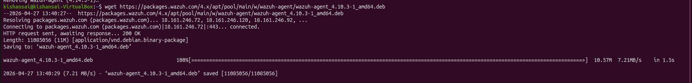

---

### Step 11 — Enable and Start the Agent

```bash
sudo systemctl enable wazuh-agent
sudo systemctl start wazuh-agent
```

I enabled the agent to start on boot and then started it immediately.

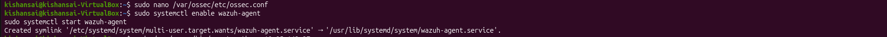

---

### Step 12 — Register the Agent with the Server

```bash
sudo /var/ossec/bin/agent-auth -m 10.85.143.37 -A ubuntu-agent
```

I registered the agent with the Wazuh manager using its IP address and gave it the name `ubuntu-agent`. The agent connected successfully and was visible on the server.

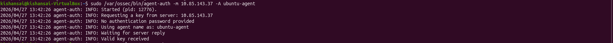

---

## 6. Dashboard & Log Analysis

---

### Step 13 — Access the Wazuh Dashboard

```
https://10.85.143.37
```

I opened the Wazuh Dashboard in the browser. The dashboard loaded successfully and the `ubuntu-agent` appeared as a connected agent.

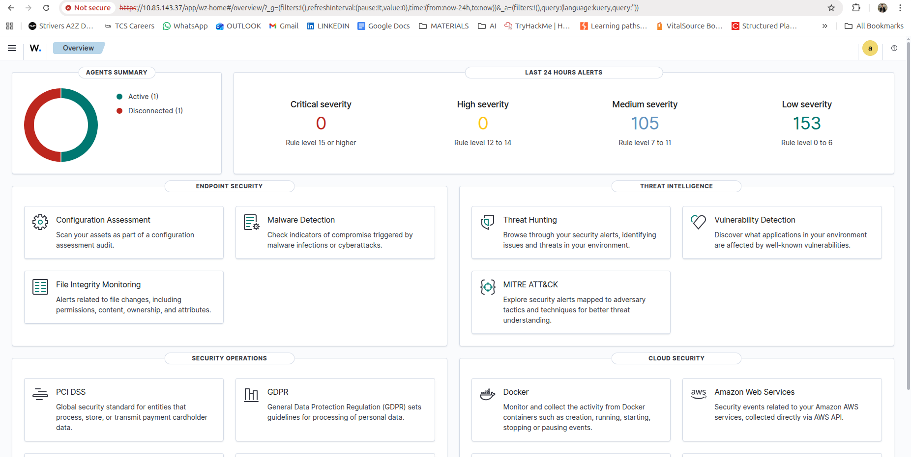

---

### Step 14 — Detect Failed Login Attempts

The dashboard immediately started showing security events. I could see failed login attempts being detected with full details including timestamp, username, and source system.

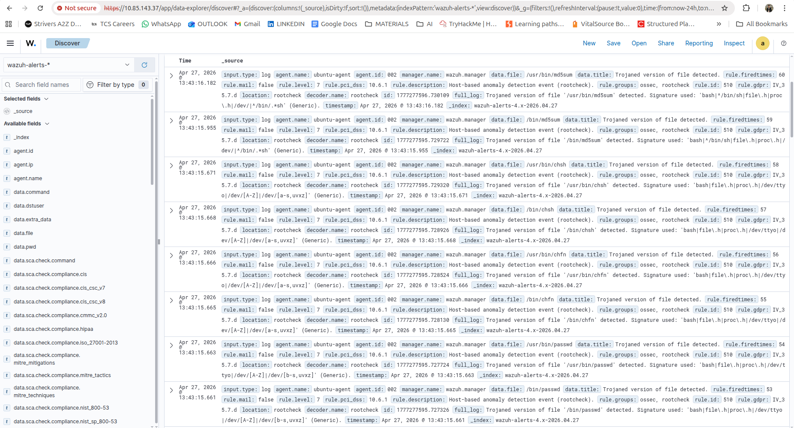

---

### Step 15 — Explore Logs in the Discover View

**Filter applied:**
```
agent.name: "ubuntu-agent"
```

Using the Discover tab, I filtered logs specifically for my Ubuntu agent. The logs were well-structured and fully searchable, making it easy to investigate any event in detail.

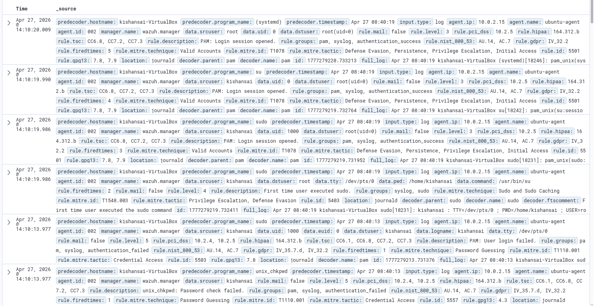

---

## 7. Conclusion

This project gave me hands-on experience with how a real SIEM system works from end to end:

- Logs are **collected** from endpoints via agents
- Security events are **detected** automatically by the Wazuh manager
- Everything is **visualized** in a centralized, searchable dashboard

It wasn't just a tool installation — it was a complete workflow from deployment to threat detection.

---

## 8. Key Learnings

| Area | What I Learned |
|---|---|
| SIEM Architecture | How Agent → Manager → Dashboard work together |
| Docker Deployment | Running multi-component services as containers |
| Log Analysis | Filtering and investigating security events |
| Threat Detection | Identifying failed logins and anomalies in real time |

---

## 9. Future Improvements

- Add multiple agents across different systems
- Set up automated alerts via Email or Slack
- Integrate threat intelligence feeds for advanced detection

---
